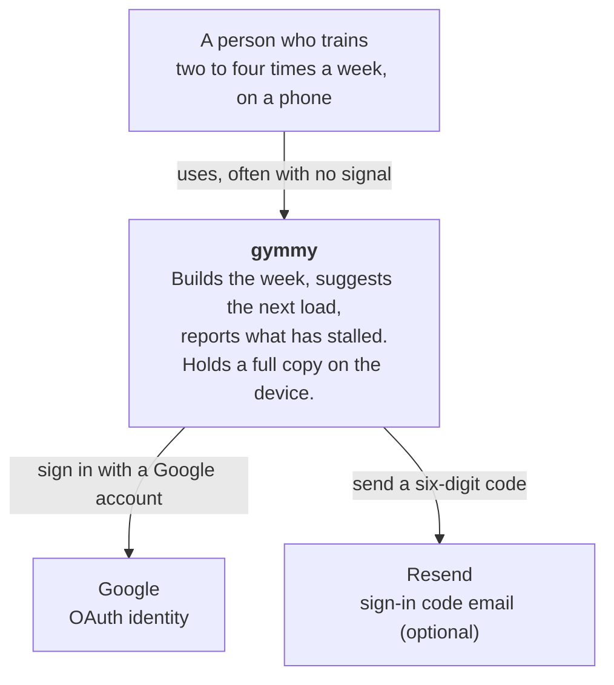
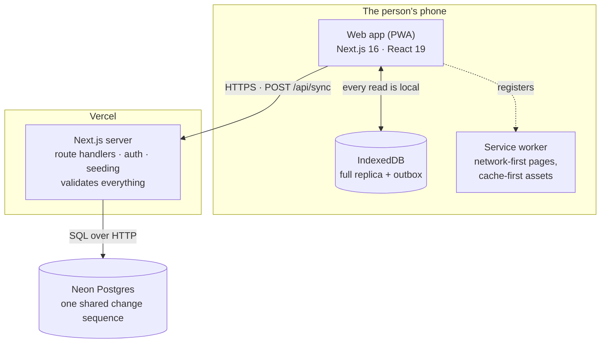
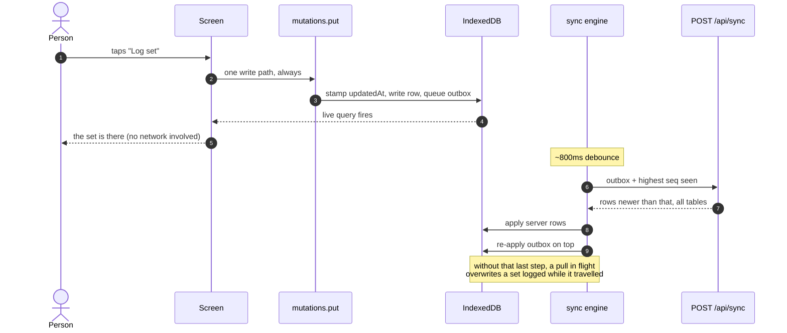

# Architecture

## The system, and what it talks to



Both external systems are on the **sign-in path only**. Once somebody is signed
in, gymmy depends on nobody: a total Google outage cannot stop an existing user
from training.

## The pieces that run



Two databases on purpose. The local one is what makes the app work in a
basement; the remote one is what makes it survive a lost phone. Neither is
redundant.

## The layers, and what may import what

```
packages/domain  ──►  (nothing)
apps/web         ──►  packages/domain
e2e              ──►  apps/web (over HTTP), packages/domain (for fixtures)
```

`packages/domain` has **no runtime dependencies**, and that is enforced
structurally rather than by convention: there is nothing in its `package.json` to
import, so a stray `import { useState }` fails to resolve. This is what lets the
same coverage rule run in a React component and in a server-side seed without a
second implementation to disagree with the first.

| Where | What lives there |
| --- | --- |
| `packages/domain/src/types.ts` | Every record shape, and the `TABLES` list the sync layer is generated from |
| `packages/domain/src/model.ts` | Pure derived values — coverage, progress, the strength score, `index()` |
| `packages/domain/src/coach.ts` | Program generation and double progression |
| `packages/domain/src/insights.ts` | What Progress and the calendar *say* — session series, drawdowns, the triage, a day |
| `packages/domain/src/splits.ts` | Split presets, slot materialisation, coverage sets |
| `packages/domain/src/seed.ts` `details.ts` | The default library: 7 patterns, 70 exercises, their photos and descriptions |
| `apps/web/src/lib/client/` | IndexedDB, the sync engine, every mutation |
| `apps/web/src/lib/db/` | Drizzle schema, per-account seeding, the demo |
| `apps/web/src/lib/db/demo-history.ts` | Pure: the demo account's training, as data points |
| `apps/web/src/lib/sync/` | The wire contract and per-table row validation |
| `apps/web/src/app/(app)/` | The five tabs |
| `apps/web/src/components/` | The UI kit, the charts, the calendar, the sheets, the lightbox, the profile card, the recovery screens |

## How a set gets saved



1. A tap calls a function in `lib/client/mutations.ts`. **Every** write goes
   through `put()` there — it stamps `updatedAt`, writes to IndexedDB, and
   queues an outbox row. Nothing in the UI writes to Dexie directly, so no
   screen can save something the server will never hear about.
2. The UI re-renders from the local write. `useLiveQuery` is watching, so this
   is immediate and does not wait on anything.
3. `sync.ts` debounces ~800ms, then posts the outbox to `/api/sync` along with
   the client's cursor.
4. The server validates each row against `lib/sync/rows.ts`, upserts it with
   last-write-wins on `updatedAt`, assigns a `seq` from a shared Postgres
   sequence, and returns everything newer than the cursor.
5. The client applies the server's rows, **then re-applies anything still in the
   outbox on top**. Without that last step a pull in flight would overwrite a
   set logged while it was travelling, and it would look to the user like the
   app simply lost it.

### The cursor is the subtle part

Each table is paged independently. Taking the highest `seq` across all of them
loses data outright: if logs fill their page at seq 1,000 while the profile sits
at 5,000, a cursor of 5,000 means every log in between is never requested again —
silently, permanently. So a table that filled its page **holds the cursor down**
to the last row it actually sent and the client is told to come straight back.
`e2e/tests/sync-paging.spec.ts` is the guard.

## Offline and recovery

The service worker (`apps/web/sw-src.js`, stamped with the build id by
`scripts/build-sw.mjs`) is network-first for navigations and cache-first for
content-hashed assets. `/api/*` is never cached.

Four separate things stop the app becoming unusable, and each one exists because
something got somebody stuck:

- **`app/(app)/error.tsx`** — a render crash offers a reset instead of a blank
  screen.
- **The stuck-load deadline** in `app/(app)/layout.tsx` — "waiting for the
  profile" has an honest failure mode of waiting forever, so after 12s it stops
  pretending.
- **`components/boot-watchdog.tsx`** — plain DOM inlined in `<head>`, because if
  the bundle fails to load there is no React and no error boundary to help.
- **Seed repair in `/api/sync`** — an account with no rows gets seeded on the
  spot. See [data.md](./data.md#seeding).

## Moving between tabs

Tabs slide, and the direction carries meaning: left is forward, right is back.
Both the tab bar and a swipe produce the same movement, because they are the
same journey.

- `components/page.tsx` wraps each tab's content in React's `<ViewTransition>`.
  **It lives in the page, not the layout** — a layout persists across
  navigation, so its enter and exit animations never fire. Only something that
  genuinely unmounts can be animated out.
- The direction is a *transition type*: `transitionTypes` on the tab `<Link>`,
  and the same on `router.push` for a swipe. `default: 'none'` means a
  navigation carrying no type — the browser's back button, `router.refresh()`,
  a Suspense reveal — does not slide, because it was not a move.
- The header and the tab bar carry their own `viewTransitionName` and are
  pinned. Without a fixed reference the whole viewport appears to move rather
  than the page inside it.
- The flex column that spaces the cards lives on `[data-page]`, not on `<main>`.
  `<main>` persists; spacing applied there would leave the cards travelling
  independently of the box supposed to be carrying them.
- The per-card stagger is suppressed during a transition
  (`html:active-view-transition`) — two animations describing one event read as
  jitter.

`prefers-reduced-motion` zeroes the view-transition pseudo-elements explicitly:
they sit outside the `*` selector that handles everything else.

## Things that will surprise you

- **React Compiler is on.** It rejects a `useMemo` whose dependency comes through
  a cross-package call. Read `DEFAULT_PREFS.days` directly rather than calling
  `prefs(profile).days` inside a dependency array.
- **`next start` serves the last `next build`.** The e2e suite does not rebuild,
  so a UI change tests the *previous* build unless you build first.
- **`drizzle.config.ts` reads `.env.local` with `override: true`**, but captures
  an explicitly exported `DATABASE_URL` first — so `DATABASE_URL=<remote> npm run
  db:migrate` really does migrate the remote.
- **Auth.js reads email-callback params from the query string**, never the body.
  This broke email sign-in for the entire life of the feature.
