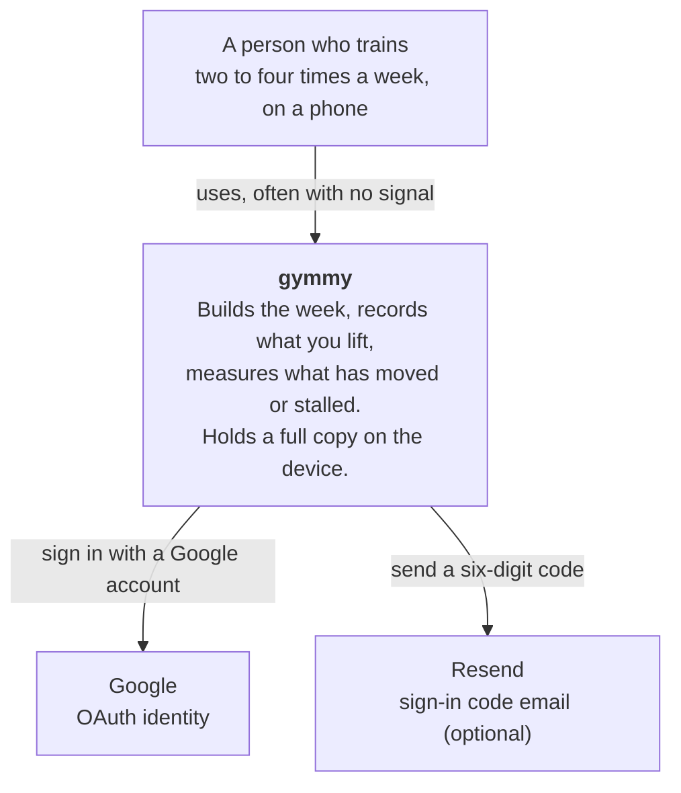
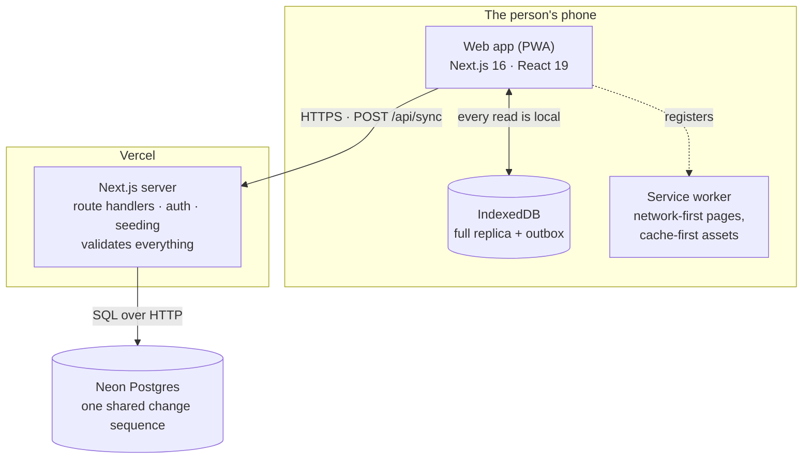
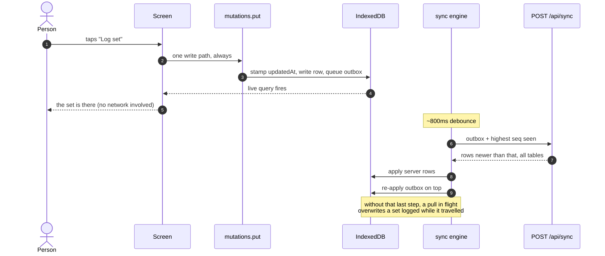

# Architecture

## The system, and what it talks to



Both external systems are on the **sign-in path only**. Once somebody is signed
in, gymmy depends on nobody: a total Google outage cannot stop an existing user
from training.

## The pieces that run



Two databases on purpose. The local one is what makes the app work in a
basement; the remote one is what makes it survive a lost phone. Neither is
redundant.

## The layers, and what may import what

```
packages/domain  ──►  (nothing)
apps/web         ──►  packages/domain
e2e              ──►  apps/web (over HTTP), packages/domain (for fixtures)
```

`packages/domain` has **no runtime dependencies**, and that is enforced
structurally rather than by convention: there is nothing in its `package.json` to
import, so a stray `import { useState }` fails to resolve. This is what lets the
same coverage rule run in a React component and in a server-side seed without a
second implementation to disagree with the first.

| Where | What lives there |
| --- | --- |
| `packages/domain/src/types.ts` | Every record shape, and the `TABLES` list the sync layer is generated from |
| `packages/domain/src/model.ts` | Pure derived values — coverage, progress, `index()` |
| `packages/domain/src/strength.ts` | The two strength numbers: gymmy's index and DOTS |
| `packages/domain/src/load.ts` | What the number in the weight box means per exercise — per hand, the bar, a machine setting — and which bodyweight lifts move the whole body |
| `packages/domain/src/entry.ts` | Setting a number on Train: each equipment's ruler range and step, the plates, the bars, where a first set starts, and how many decimals a scale's numbers are written with |
| `packages/domain/src/coach.ts` | Program generation, what a swap may offer and the range it leaves, and reading back the last session on a lift |
| `packages/domain/src/insights.ts` | What Progress and the calendar *say* — session series, drawdowns, the triage, a day |
| `packages/domain/src/splits.ts` | Split presets, slot materialisation, coverage sets |
| `packages/domain/src/plans.ts` | A plan as a portable thing: no ids from any account, exercises by name |
| `packages/domain/src/catalogue.ts` `catalogue-ids.ts` `details.ts` | The exercise library, shared by every account and authored in code; the append-only record of published ids; photos and descriptions |
| `packages/domain/src/seed.ts` | A new account's patterns and slot skeleton. `SEED_EXERCISES` is a view of the catalogue kept for older seeding code |
| `apps/web/src/lib/client/` | IndexedDB, the sync engine, every mutation |
| `apps/web/src/lib/db/` | Drizzle schema, per-account seeding, the demo |
| `apps/web/src/lib/db/demo-history.ts` | Pure: the demo account's training, as data points |
| `apps/web/src/lib/sync/` | The wire contract and per-table row validation |
| `apps/web/src/lib/db/plans.ts` | Plans, groups, shares, and who can see what. **Not** a replicated table |
| `apps/web/src/lib/api/plans.ts` | The session/trainer guard and the wire schema for the plan endpoints |
| `apps/web/src/app/(app)/` | The five tabs |
| `apps/web/src/components/` | The UI kit, the charts, the calendar, the sheets, the lightbox, the profile card, the recovery screens |
| `apps/web/src/components/entry/` | Train's number controls — buttons, the ruler, the plate loader, gymmy's keypad — and the card's open/close. `rolling-number.tsx` rolls a changed digit in from the way the number moved |
| `apps/web/src/components/motion.ts` | The motion tokens for JavaScript — easings, durations, reduced motion. See [Motion](#motion) |
| `apps/web/src/components/presence.tsx` `sheet-gesture.ts` | Keeping a sheet or the keypad on screen until its exit has played, and the drag that dismisses a sheet. See [Sheets](#sheets) |
| `apps/web/src/components/info-tip.tsx` `place-tip.ts` | The ⓘ that holds an explanation instead of a paragraph on the screen, and where its popover goes. See [Explanations behind an info button](#explanations-behind-an-info-button) |
| `apps/web/src/components/switch.tsx` | An on/off setting, as the platform's own `<input type="checkbox" switch>` |

## How a set gets saved



1. A tap calls a function in `lib/client/mutations.ts`. **Every** write goes
   through `put()` there — it stamps `updatedAt`, writes to IndexedDB, and
   queues an outbox row. Nothing in the UI writes to Dexie directly, so no
   screen can save something the server will never hear about. The one write
   that skips `put()` does so on purpose: `rememberBar`, the bar weight picked
   on a barbell card, goes to the local `meta` table only — it describes a
   gym's equipment, not training, and is not meant to reach the server.
2. The UI re-renders from the local write. `useLiveQuery` is watching, so this
   is immediate and does not wait on anything.
3. `sync.ts` debounces ~800ms, then posts the outbox to `/api/sync` along with
   the client's cursor.
4. The server validates each row against `lib/sync/rows.ts`, upserts it with
   last-write-wins on `updatedAt`, assigns a `seq` from a shared Postgres
   sequence, and returns everything newer than the cursor.
5. The client applies the server's rows, **then re-applies anything still in the
   outbox on top**. Without that last step a pull in flight would overwrite a
   set logged while it was travelling, and it would look to the user like the
   app simply lost it.

If step 1's own write to IndexedDB fails, nothing was saved anywhere.
`put()` calls `reportStorageFailure`, which sets `storageFailure` on the sync
status: the header shows a magenta triangle and a one-line warning that stays
until the person dismisses it. It is a separate field, not a sync state,
because as a state the next sync replaced it within seconds — so no sync
outcome can clear it. It is also written to localStorage (not IndexedDB, the
store that just failed), so a reload keeps it: reloads come unasked, from the
service worker's update and from phones discarding background pages. Only
dismissing it or a sign-out clears it. The write is best effort: where the
browser blocks site data, the warning lasts until the page goes.

### The cursor is the subtle part

Each table is paged independently. Taking the highest `seq` across all of them
loses data outright: if logs fill their page at seq 1,000 while the profile sits
at 5,000, a cursor of 5,000 means every log in between is never requested again —
silently, permanently. So a table that filled its page **holds the cursor down**
to the last row it actually sent and the client is told to come straight back.
`e2e/tests/sync-paging.spec.ts` is the guard.

## Plans, and the one place two people share a row

Everything above assumes a row belongs to exactly one person who is the only one
who edits it. Every synced table is `primaryKey(userId, id)` cascading from
`user`, and that assumption is what last-write-wins, the full replica and the
cascade all rest on.

A trainer's plan breaks both halves of it: one person writes it, many read it.
So plans live **outside the sync set** — `plans`, `plan_slots`, `user_groups`,
`group_members`, `plan_shares` and `plan_events`, reached over a small read API
rather than replicated. Putting them in would mean a trainer closing their
account destroyed plans other people train on, and would hand last-write-wins
the job of refereeing two people editing one row, which
[the decision log](https://dextra.atlassian.net/wiki/spaces/~712020296b34b54b84454489d16860c808e925/pages/934543399)
names as the exact condition for revisiting it.

**What crosses into an athlete's data is not the plan but its effect.** Applying
one materialises ordinary `slots`, an appended `splitPeriod` and generated
`entries`, through the same `installSkeleton` a preset goes through — it is the
third caller alongside `applySplit` and `applyCustomSplit`. After that moment
nothing downstream knows a trainer was involved, which is exactly what keeps
historisation, offline and last-write-wins working untouched.

It is a **copy, taken once**. `profile.planId` and `planVersion` record what was
applied so a newer edition can be *offered*; the trainer never reaches into a
week somebody is standing in.

Traps worth knowing before touching any of it:

- **Plans carry exercises by name.** Catalogue ids are shared, but an account
  created before the catalogue still has its own ids on every stored row, read
  as aliases by `index()` — so a plan built on ids would still miss for them.
  A name resolves against either; one the athlete lacks costs them that
  exercise and not that session.
- **Read history through `exerciseById`, offer through `exercises`.** A
  retired catalogue entry is in the first and not the second. Listing history
  from `exercises` makes a retired movement's training vanish.
- **Read the plan through `planOf(profile)`.** The server does not re-send a row
  because a column was added, so a device that synced before `planId` existed
  has no such key and `profile.planId !== null` is `true` for an account that
  has never seen a plan.
- **A plan's day numbers can skip.** The API takes any day from 0 to 13, and
  the installer builds days from zero. `planToDrafts`, `planFill` and
  `planSessions` all renumber through one map (`denseSessions`), so days 0 and 2
  install as Day A and Day B. Renumber in only one of them and a day installs
  empty, or a trainer's choice lands on no slot.

Visibility is computed per request rather than stored on the plan: you own it,
or a live share points at you, directly or through a group you are in. Cached as
a flag, every membership change would have to find and rewrite every plan, and
the first one missed leaves somebody reading a plan they were removed from.

> **Known gap:** `installSkeleton` is a dozen writes with no wrapping
> transaction, and the profile is the last of them. Tear the page down partway —
> a navigation, a crash — and the week installs while the profile still names
> the old split, so Settings and the Week tab disagree until it is applied
> again. This predates plans and is true of `applySplit` too; it surfaced when
> an e2e test navigated the moment the button was clicked. Dexie has
> transactions; nothing here uses them yet.

## Offline and recovery

The service worker (`apps/web/sw-src.js`, stamped with the build id by
`scripts/build-sw.mjs`) is network-first for navigations and cache-first for
content-hashed assets. `/api/*` is never cached.

Four separate things stop the app becoming unusable, and each one exists because
something got somebody stuck:

- **`app/(app)/error.tsx`** — a render crash offers a reset instead of a blank
  screen.
- **The stuck-load deadline** in `app/(app)/layout.tsx` — "waiting for the
  profile" has an honest failure mode of waiting forever, so after 12s it stops
  pretending.
- **`components/boot-watchdog.tsx`** — plain DOM inlined in `<head>`, because if
  the bundle fails to load there is no React and no error boundary to help.
- **Seed repair in `/api/sync`** — an account with no rows gets seeded on the
  spot. See [data.md](./data.md#seeding).

## Moving between tabs

Tabs slide, and the direction carries meaning: left is forward, right is back.
Both the tab bar and a swipe produce the same movement, because they are the
same journey.

- `components/page.tsx` wraps each tab's content in React's `<ViewTransition>`.
  **It lives in the page, not the layout** — a layout persists across
  navigation, so its enter and exit animations never fire. Only something that
  genuinely unmounts can be animated out.
- The direction is a *transition type*: `transitionTypes` on the tab `<Link>`,
  and the same on `router.push` for a swipe. `default: 'none'` means a
  navigation carrying no type — the browser's back button, `router.refresh()`,
  a Suspense reveal — does not slide, because it was not a move.
- The header and the tab bar carry their own `viewTransitionName` and are
  pinned. Without a fixed reference the whole viewport appears to move rather
  than the page inside it.
- The flex column that spaces the cards lives on `[data-page]`, not on `<main>`.
  `<main>` persists; spacing applied there would leave the cards travelling
  independently of the box supposed to be carrying them.
- There is no per-card entry animation. The slide is the arrival; a card
  animation on top restarted the moment the transition ended and read as the
  page reloading (`globals.css` says why, `navigation.spec.ts` guards it).

Under reduced motion a tab change is a short crossfade: the reduced-motion block
in `globals.css` replaces the two directional animations with a fade and stops
named elements travelling (`::view-transition-group(*)`).

## Motion

One set of tokens in `globals.css`, in a plain `:root` block rather than
`@theme`: Tailwind emits a theme variable only when a class uses it, and some
of these are read by JavaScript alone.

- **Durations** `--dur-press` 100, `--dur-fast` 160, `--dur-base` 240,
  `--dur-page` 300, `--dur-sheet` 360 and `--dur-sheet-out` 220 ms. **Easings**
  `--ease-out`, `--ease-in`, `--ease-drawer` (sheets, slides) and
  `--ease-spring` — a real spring through `linear()` where supported, a cubic
  otherwise, for reward moments only.
- **Distances** are tokens too: `--press`, `--press-deep`, `--pop-from`,
  `--rise`, `--slide-by`.
- **In a class**, `duration-(--dur-fast) ease-(--ease-out)`. A pressable
  control takes the `press` (or `press-deep`) utility, never its own
  `active:scale-*` — Tailwind's scale sets `scale`, and the hand-written ones
  transitioned `transform`, so every press snapped.
- **Reduced motion** keeps short fades and removes movement. The media block
  sets every distance to nothing and every duration longer than `--dur-fast`
  to it, so a pop becomes a fade and a sheet fades in where it stands. What it
  cannot reach opts out itself: a size change with `motion-reduce:`
  (`Collapse` drops to 1 ms so `transitionend` still fires), and anything
  JavaScript moves with `reducedMotion()`. It used to zero every animation and
  transition, fades included.
- **JavaScript** reads the same tokens through `components/motion.ts`:
  `easing()` for the Web Animations API, `curve()` for a frame loop (it reads
  `cubic-bezier()` and `linear()`), `duration()` in milliseconds (already
  shortened under reduced motion), `reducedMotion()`.

`motion.test.ts` holds the stylesheet and the source to this: the JavaScript
fallbacks equal the CSS, reduced motion removes every distance, the press
transitions `scale`, and no hard-coded duration, easing, `active:scale-*` or
reduced-motion media query appears outside the system. `motion.spec.ts` checks
what the browser does with it.

## Sheets

Every sheet is `Sheet` in `components/ui.tsx`, portalled to the body. The
keypad is its own component but leaves the same way.

- **It leaves as it came.** A sheet stays mounted until its exit has played:
  the entrance backwards (sinking by `--rise` as it fades, `--dur-sheet-out`),
  or, after a drag, on down off the screen at the finger's speed. While it
  leaves it is `inert`, `aria-hidden` and takes no taps (`data-state="closed"`),
  so the page behind answers at once and `getByRole('dialog')` no longer finds
  it. Under reduced motion it only fades.
- **`<Presence>` is what keeps it** (`components/presence.tsx`). `open` turning
  false is handled inside `Sheet`. A sheet its caller mounts with
  `{x && <…/>}` needs the condition wrapped — `<Presence>{x && <…/>}</Presence>`
  — or it is gone in one frame with nothing played. `sheet.test.ts` fails on a
  bare one. Each opening is a new mount, even mid-exit, so a reopened picker or
  keypad starts empty, as before.
- **Drag down to dismiss** (`components/sheet-gesture.ts`, Vaul's rules). Touch
  only. It decides on the first move whose gesture it is, because a browser
  stops letting the page cancel a touch once it has started scrolling; it
  starts moving past 10 px, so a wobbly tap is still a tap. A drag is the
  sheet's only where the content under the finger is scrolled to its top and
  has not scrolled in the last 100 ms; sideways is never its. Pulled up, it
  resists (iOS's rubber band). A second finger cancels. Let go, it closes on a
  flick (over 0.4 px/ms) or past a quarter of its height, else springs back
  over `--dur-base`. The transform is written straight onto the panel and the
  dimmed layer behind lightens with it; `will-change` only while a finger is
  down.
- **Focus** moves into the sheet as it opens and back to what had it as it
  closes. The keypad does the same, onto its `opener`.
- **`data-no-swipe`** is on every sheet and the keypad, so a sideways drag on
  one never changes the tab behind it.
- The keypad cannot be dragged away: it is tapped fast, and a thumb sliding off
  a key must not throw the typed number away.

## Explanations behind an info button

Explanations live behind an ⓘ (`components/info-tip.tsx`), not in paragraphs on
the screen. Text stays visible only where hiding it would cause a wrong entry,
lost data or a blank screen: states, warnings, empty states and their one
action, consequences before a destructive or replacing action.

- **Two modes, one look.** With children it opens a small popover (about three
  sentences at most); with `onOpen` it opens an existing sheet, for anything
  longer — lists, the person's own numbers, pictures. It is the only info
  button; the old `InfoButton` is gone.
- **The popover is native** (`popover="auto"` + `popovertarget`): the top layer
  ignores a faded card or a transformed sheet around it, nothing moves when it
  opens, and opening one closes any other. `placeTip` (pure, unit-tested)
  places it before its first frame, below the ⓘ when there is room, never
  within 16 px of a side.
- **While open it listens** — attached in `beforetoggle`, taken off as it
  closes: Escape on `window` in the capture phase, stopped there so a sheet
  underneath survives; a tap outside, closed by hand because Safari before
  18.3 does not; scroll and resize, to follow the ⓘ.
- **Accessible:** `aria-expanded`/`aria-controls`, the popover is
  `role="note"` named after the ⓘ, and the ⓘ is described by the text even
  while it is closed. A control whose hint moved behind an ⓘ keeps it as its
  description through `textId` (the Settings switch does).
- **Placement rules:** never inside a `<button>`, `<a>`, `<label>` or heading;
  the popover is a `span` sibling straight after the ⓘ. The label names the
  subject (`info.more`: "More on {subject}") and never starts with "About ",
  which belongs to the exercise names' button. The exercise names keep their
  outlined "i"; this one is a filled disc.

## Things that will surprise you

- **React Compiler is on.** It rejects a `useMemo` whose dependency comes through
  a cross-package call. Read `DEFAULT_PREFS.days` directly rather than calling
  `prefs(profile).days` inside a dependency array.
- **`next start` serves the last `next build`.** The e2e suite does not rebuild,
  so a UI change tests the *previous* build unless you build first.
- **`drizzle.config.ts` reads `.env.local` with `override: true`**, but captures
  an explicitly exported `DATABASE_URL` first — so `DATABASE_URL=<remote> npm run
  db:migrate` really does migrate the remote.
- **Auth.js reads email-callback params from the query string**, never the body.
  This broke email sign-in for the entire life of the feature.
