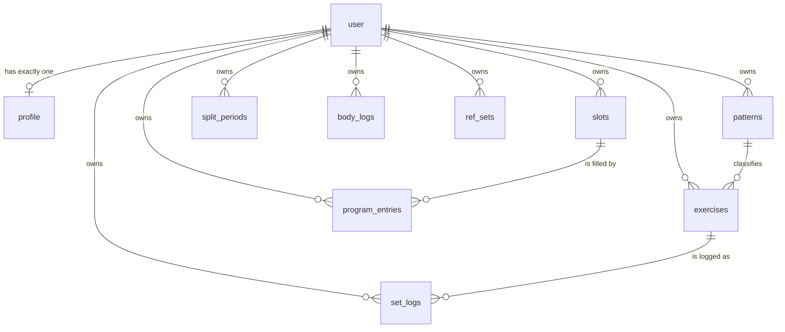

# Data

## What is stored

Every arrow out of `user` is `ON DELETE CASCADE`, which is why erasing an account
is one statement. Note what does **not** point at `program_entries`: a set log
references the *exercise*, never the plan — which is what lets the week be
rebuilt without touching a single thing you lifted.

## Two stores, one shape

Every synced record carries `id`, `updatedAt` and a soft `deletedAt`, declared
once in `types.ts` as `Synced` and once in `schema.ts` as the `synced` column
spread. The soft delete is not squeamishness: a hard delete cannot replicate to a
device that is currently offline — it would simply reappear on the next push.

`TABLES` in `types.ts` is the list everything else is derived from: the Dexie
stores, `DOMAIN_TABLES`, `SYNC_TABLES`, and the Zod schemas in
`lib/sync/rows.ts`. **Adding a table means touching all of those**, plus a Dexie
version bump, plus a migration. The typechecker catches most of it; the Dexie
bump it does not.

| Table | Notes |
| --- | --- |
| `patterns` | The seven, plus isolation. `counts: false` means "not a coverage box" |
| `exercises` | The library. `description` and `images` were added later — see the normalisation note below |
| `slots` | The week's skeleton. Editing these by hand is what makes a split custom |
| `splitPeriods` | Append-only. The whole historisation model |
| `entries` (`program_entries`) | The generated plan: which exercise fills which slot |
| `logs` (`set_logs`) | The dominant write. One row per set |
| `refSets` | Reference sets, outside the plan |
| `bodyLogs` | Bodyweight, dated. Denominator of the strength score |
| `profile` | One row per user; `id` equals `userId` |

Server-side every table has a composite primary key `(user_id, id)` and a `seq`
index. `seq` comes from one shared Postgres sequence, `change_seq`, so a single
cursor orders changes across every table.

## Adding a field to an existing table

There is a trap here that has already bricked the app once.

The server only re-sends rows whose `seq` moved, and **adding a column does not
move it**. So a device that synced before the column existed keeps rows without
the key, forever, and `row.newField.length` throws — taking the whole screen
down with it.

Two things are therefore required:

1. **Default it in `index()`** in `model.ts`, which is the single point every
   consumer reads through. That is where `description ?? ''` and `images ?? []`
   live.
2. **Backfill in the migration** if existing rows need a real value, and bump
   their `seq` if devices must re-fetch them.

## Sync protocol

`lib/sync/protocol.ts` is the wire contract, imported by both sides.
Last-write-wins per record on `updatedAt` — a deliberate choice, not a shortcut:
this is a single-user app whose dominant write is an immutable set log from one
phone, and a CRDT would be substantial machinery for a problem this data shape
does not have.

The client is not trusted. `userId` and `seq` are never accepted from the wire —
the server sets both — so a client cannot write into another account or forge its
position in the change order. Every row is validated per table by
`lib/sync/rows.ts` before it is written.

## Migrations

`drizzle-kit`, generated into `apps/web/drizzle/`. `vercel-build` runs
`drizzle-kit migrate` before `next build`, so a deploy migrates.

Use the *unpooled* URL for migrations. A pooler in transaction mode can reject or
mis-sequence DDL, and `drizzle.config.ts` prefers `DATABASE_URL_UNPOOLED` for
exactly that reason.

## Seeding

`lib/db/seed-user.ts` creates a new account's default content: the patterns, the
slot skeleton, the 70 exercises, the opening `SplitPeriod` and an un-onboarded
profile.

**It is idempotent, and that is load-bearing.** Auth.js fires `createUser`
exactly once per account, so a failure there used to be permanent: the user row
already existed, the event would never fire again, and the account was left
signed in and forever empty — which this app can only render as a loading screen
that never resolves. So:

- every row's id is `seedId(userId, kind, key)` — derived, not random;
- every insert is `onConflictDoNothing`, and the profile is never overwritten so
  a retry cannot reset settings;
- the `createUser` event is **best-effort**, logging rather than throwing;
- **`/api/sync` repairs it**: a device asking from cursor 0 and getting nothing
  back means the account has no rows, so it is seeded then and there. That is
  the one endpoint every device touches on every visit, and it costs nothing on
  a normal sync because the emptiness is read off the pull already done.

### Deleting an account

The right to erasure is not "stop showing it to them", so
[`delete-account.ts`](../apps/web/src/lib/db/delete-account.ts) deletes rather
than flags, and is the one place that knows what an account consists of.

Almost all of it falls out of the schema: every replicated table takes its
`user_id` from `user` with `ON DELETE CASCADE`, so removing that one row takes
the profile, the library, the plan, the periods, every set and every weigh-in
with it — atomically, which is what makes a half-deleted account impossible.

Two tables do not hang off `user` and would otherwise be left holding an email
address: `verificationToken` and `sign_in_attempts`, both keyed on the address
because a sign-in code is issued before anyone knows whether there is an account
behind it. They are cleared **first**, so the irreversible step is last — if the
cascade then fails, the account is intact and the worst that happened is a reset
throttle.

There is no wrapping transaction. Production runs on Neon's HTTP driver, which
has no interactive transactions; the ordering above is what makes that safe
rather than merely tolerable.

The client wipes IndexedDB before calling the server and deliberately does
**not** sync first: pushing local changes up to an account about to be erased is
work done to destroy it a moment later, and if the server call then fails the
device has still been left clean.

Its test does not check a hand-written list of tables. It asks Postgres which
tables have a `user_id`, an `email` or an `identifier`, and insists none of them
still holds a matching row — so a table added later without a cascade fails it
without anybody having to remember.

### The demo account

Signing in as `DEMO_EMAIL` (default `demo-gymmy@yopmail.com`) seeds five months
of history, a bodyweight series, a sex and a height — everything the Progress tab
needs to have something to show.

The generator is split in two on purpose. `demo-history.ts` is **pure** — it
takes the plan and today's Monday and returns rows — and holds every judgement
about what plausible training looks like. `seed-demo.ts` only turns those rows
into SQL. That is what lets the interesting half be asserted without Postgres,
which is where the mistakes actually are.

**It produces sets, and only sets.** One row per set performed, carrying what
was on the bar, how many reps went up and how many were left in reserve — the
same three numbers a person types in. Nothing derived is stored beside them: no
per-exercise curve, no session summary, no progress series. Everything the
Progress tab draws is computed back out of those points by `progressSummary`,
exactly as it is for a real account. A demo whose charts were fed from a curve
the app does not otherwise have would be a demo of something we do not ship.

Loads come from `demo-loads.ts`, **one entry per exercise**. They used to be per
*pattern*, which logged a goblet squat at 90 kg and drew the same staircase on
all seventy charts.

Each entry may also carry an **arc**, which is what stopped the demo being a
place where nothing ever goes wrong. Every lift used to be
`start × (1 + gain × curve(week))` — one shared monotone curve — so no lift
could stall, slide, appear late or be quietly dropped, and those are precisely
the four things the Progress tab exists to point out. Its lead section rendered
empty on the one account anybody opens. The arcs in force:

| Arc | Lift | What it shows |
| --- | --- | --- |
| `stall` | Barbell Bench Press | Moved for ten weeks, then sat. Reps stop wobbling too — grinding the same five *is* the stall |
| `regress` | Reverse Lunge | Peaked in July, dropped ~13%, clawing back slowly |
| `irregular` | Chest-Supported Row | Two weeks in three, so the line has real gaps |
| `late` | Step-Up | Added two months in; its line starts mid-chart |
| `abandoned` | Overhead Tricep Extension | Still on the plan, untouched since July |

On top of the arc: progress is quick early and flattens, rounds to real plate
jumps (which produces uneven plateaus by itself), and is interrupted by a deload
every sixth week, a bad session about one in ten, two missed sessions and a week
off. Bodyweight movements carry a fraction of bodyweight and progress in reps.

Noise is salted per exercise where it should be and shared where it should be: a
bad *day* hits everything you touched that evening, which is honest and makes the
charts dip together, while the rep wobble is per lift — without that, five charts
gain and lose the same rep in lockstep, which is the tell that one generator drew
all of them.

All of it is derived rather than random — the same account seeded twice produces
identical history, which is what keeps the seed safe to re-run.

Locally, `DEMO_EMAIL=dev@localhost` in `apps/web/.env.local` gives the dev-bypass
account the whole demo history, which is the fastest way to look at Progress
with something in it.
