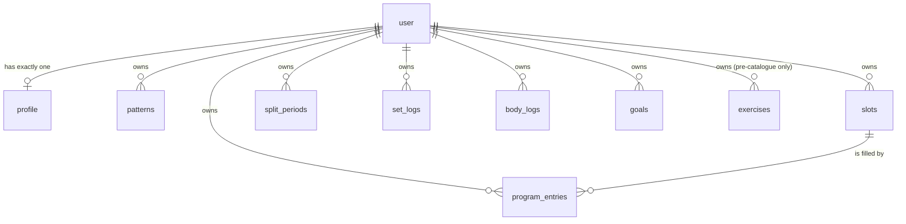

# Data

## What is stored

Every arrow out of `user` is `ON DELETE CASCADE`, which is why erasing an account
is one statement. Note what does **not** point at `program_entries`: a set log
references the *exercise*, never the plan — which is what lets the week be
rebuilt without touching a single thing you lifted.

Nor does anything point *into* an exercise. The exercise a set, plan entry or
goal names is usually not a row at all: it is an entry in the catalogue in code
(see [The exercise library](#the-exercise-library)), and `exercises` holds only
rows written before the catalogue existed, read as aliases. The full generated
diagram, with every column, is [`data-model.mmd`](./data-model.mmd); it draws
those references dotted.

## Two stores, one shape

Every synced record carries `id`, `updatedAt` and a soft `deletedAt`, declared
once in `types.ts` as `Synced` and once in `schema.ts` as the `synced` column
spread. The soft delete is not squeamishness: a hard delete cannot replicate to a
device that is currently offline — it would simply reappear on the next push.

`TABLES` in `types.ts` is the list everything else is derived from: the Dexie
stores, `DOMAIN_TABLES`, `SYNC_TABLES`, and the Zod schemas in
`lib/sync/rows.ts`. **Adding a table means touching all of those**, plus a Dexie
version bump, plus a migration. The typechecker catches most of it; the Dexie
bump it does not.

The entity relationship diagrams on Confluence are **generated from the schema
rather than drawn**. `npm run er:diagram -w @athletic/web` rewrites
[`data-model.mmd`](./data-model.mmd) and, with `-- --macro`, prints the Macro
Pack HTML to paste onto **Architecture → Data model**.
`apps/web/src/lib/db/er-diagram.test.ts` holds the committed file against
`schema.ts`, so **a new table or a renamed column fails `npm test`** until the
diagram catches up — and a table with no home in one of the three groups fails
it too, which is what makes one impossible to forget. The macro escaping is
done in code and asserted to round-trip, because a bare quote in the mermaid
source makes Confluence drop the whole attribute and save an empty box with no
error anywhere.

Two things in there are still written by hand, and the test only checks that
they stay *valid*: which group a table belongs to, and the relationships the
schema cannot express — `set_logs.exercise_id` and `exercises.pattern_id` are
plain text columns, because the target is keyed on `(user_id, id)` and the
referencing column carries only the id half.

| Table | Notes |
| --- | --- |
| `patterns` | The seven, plus isolation. `counts: false` means "not a coverage box" |
| `exercises` | **Legacy rows only.** The library is the catalogue in code — see *The exercise library* below. Accounts created before it still hold their copied rows, which `index()` reads as aliases; new accounts get none. Never delete one: sets point at its id |
| `slots` | The week's skeleton. Editing these by hand is what makes a split custom |
| `splitPeriods` | The whole historisation model. A switch adds a period from this Monday and never edits an older one; a second switch in the same week replaces that week's period |
| `entries` (`program_entries`) | The generated week: which exercise fills which slot on which day. Unrelated to the planned Programmes feature (a trainer running somebody's training), which is why the diagram's line to `exercises` reads "schedules" |
| `logs` (`set_logs`) | The dominant write. One row per set |
| `bodyLogs` | Bodyweight, dated. The denominator of both strength numbers |
| `goals` | One lift the user has asked to be judged on, until a date. Nothing else in the app evaluates progression without one |
| `profile` | One row per user; `id` equals `userId`. Also carries how Train takes numbers — `entryMode` (buttons or ruler) and `plateLoader` — because, like the unit, the choice belongs to the person, not the phone |

Two things live on the device and nowhere else, and `wipeLocal` clears both on
sign-out with everything else:

- the **bar weight** picked on a barbell card, per exercise, in Dexie's `meta`
  table under `bar:<unit>:<exerciseId>`. It is equipment in one gym, not
  training, so it is not synced;
- an undismissed **storage-failure warning**, in localStorage under
  `gymmy.storageFailure` — not in Dexie, because Dexie is the store whose
  write just failed. It is the only thing gymmy keeps in localStorage.

Server-side every table has a composite primary key `(user_id, id)` and a `seq`
index. `seq` comes from one shared Postgres sequence, `change_seq`, so a single
cursor orders changes across every table.

## The tables that are not synced

Six of them, and they are the only rows in the system written by one person and
read by another:

| Table | Notes |
| --- | --- |
| `plans` | A trainer's plan. `version` bumps on every publish of an already-published plan |
| `plan_slots` | Its skeleton. Exercises are named, never referenced by id — see below |
| `user_groups` | A set of people, allowed to contain one |
| `group_members` | Plain many-to-many. A group of one is not a special case |
| `plan_shares` | One target: a person or a group. Revoked, never deleted |
| `plan_events` | Append-only audit. The only table that does **not** cascade |

They sit outside `TABLES` deliberately. Everything in the sync set is
`primaryKey(user_id, id)` cascading from `user`, which encodes "one person owns
this row and is the only one who edits it" — and a plan breaks both halves. In
the sync set, a trainer closing their account would destroy plans other people
train on, and last-write-wins would be refereeing edits between two people.

**Plans carry exercises by name, not by id.** Exercise ids used to be per
account — `seedId(userId, 'exercise', name)`, and a random UUID before that — so a
trainer's id for a bench press matched nothing in any other account, and a plan
built on ids would have applied cleanly and left an empty week. The shared
catalogue changes that for new data: every account now reads the same `ex-…`
ids. Plans still travel by name all the same (D-011), because an account created
before the catalogue still has its own ids on every row it stored — read as
aliases by `index()`, but still its own. A name resolves against either. One the
athlete lacks costs them that exercise and not that session.

`plan_events` is the deliberate exception to the cascade. Deleting a plan, a
group or the person who acted sets the reference to null and keeps the event,
with the name it had at the time copied alongside. Erasure has to remove the
person; it does not have to remove the fact that a plan was shared with forty
people in March. `delete-account.test.ts` asserts both halves of that.

A deletion is itself an event, written after the delete with the name and no
id: `plan_id` and `group_id` are foreign keys, so naming a row that is gone
fails the insert. (One transaction for both is not possible: the Neon HTTP
driver has none.) Audit writes are best-effort in the app, because a failed one
must not refuse a trainer's edit, but `record()` rethrows under Vitest —
swallowing the error is how `plan.deleted` and `group.deleted` went missing on
every call without a test noticing. `plans.test.ts` reads both back.

## Adding a field to an existing table

There is a trap here that has already bricked the app once.

The server only re-sends rows whose `seq` moved, and **adding a column does not
move it**. So a device that synced before the column existed keeps rows without
the key, forever, and `row.newField.length` throws — taking the whole screen
down with it.

Two things are therefore required:

1. **Default it in `index()`** in `model.ts`, which is the single point every
   consumer reads through. That is where `description ?? ''` and `images ?? []`
   live. A **profile setting** is defaulted in `prefs()` in `prefs.ts` instead
   — the one way settings are read — and screens must read it through
   `prefs(profile)`, never off the row: `entryMode` and `plateLoader` arrived
   this way, and a row synced before them has neither key.
2. **Backfill in the migration** if existing rows need a real value, and bump
   their `seq` if devices must re-fetch them.

## Sync protocol

`lib/sync/protocol.ts` is the wire contract, imported by both sides.
Last-write-wins per record on `updatedAt` — a deliberate choice, not a shortcut:
this is a single-user app whose dominant write is an immutable set log from one
phone, and a CRDT would be substantial machinery for a problem this data shape
does not have.

The client is not trusted. `userId` and `seq` are never accepted from the wire —
the server sets both — so a client cannot write into another account or forge its
position in the change order. Every row is validated per table by
`lib/sync/rows.ts` before it is written.

## Migrations

`drizzle-kit`, generated into `apps/web/drizzle/`. `vercel-build` runs
`drizzle-kit migrate` before `next build`, so a deploy migrates.

Use the *unpooled* URL for migrations. A pooler in transaction mode can reject or
mis-sequence DDL, and `drizzle.config.ts` prefers `DATABASE_URL_UNPOOLED` for
exactly that reason. It reads that variable from the shell only, never from
`.env`: `DATABASE_URL_UNPOOLED=<direct URL> npm run db:migrate`.

### Dropping a table takes two deploys

`vercel-build` runs `drizzle-kit migrate` **before** it builds, so a migration
lands while the previous deployment is still serving traffic. If that migration
drops a table the previous code still queries — `pull()` reads every table in
`SYNC_TABLES` — every sync answers 500 until the new deployment is live. Nothing
is lost (the outbox holds on to unsent rows), but every device stalls for the
length of the build.

So a table is retired in two steps:

1. **Remove every use.** Take it out of `SYNC_TABLES`, `TABLES`, `rows.ts`, the
   spec and the client, and delete its Dexie store with a new version that maps
   it to `null` — but leave its `schema.ts` declaration, so no migration is
   generated.
2. **Next deploy: drop it.** Count its rows in production first. Then delete the
   declaration, run `npm run db:generate` for the `DROP TABLE`, regenerate the
   ER diagram and paste it onto Confluence.

`ref_sets` was retired this way: every use removed in one deploy, the table dropped in the next, after production showed it had never held a row.

## The exercise library

`packages/domain/src/catalogue.ts` is the library: one list, authored in code,
that every account gets. It replaced copying seventy rows into each account at
sign-up, which meant an exercise added to the library reached nobody who already
had one — seeding only ever runs for a new, empty account.

**No stored id was rewritten to get here, and none ever will be.** That was the
design ruled out, for a specific reason: a bad id migration is the one failure
that looks to the user like their training was deleted, and it would have run
behind no foreign key while devices were still pushing old ids from their
outboxes. Instead:

- **Accounts from before the catalogue keep their rows, as aliases.** `index()`
  matches each row to a catalogue entry by name and reads every set, plan entry
  and goal pointing at the old id as pointing at the catalogue's. It builds the
  aliases from soft-deleted rows too, because their sets still exist. A row the
  catalogue does not know stays an exercise in its own right. Nothing is written;
  every write path takes its rows from the store, never from `index()`.
- **`ix.exerciseIdOf(id)`** maps any id an exercise has ever had to the one in
  use, for ids that arrive from outside `index()`. The goal and history
  functions apply it at their entry.
- **Ids are written out, never computed** — `ex-` plus a slug of the name when
  it was added, then frozen. `catalogue-ids.ts` is the append-only record of
  every id ever published, and `catalogue.test.ts` fails if one stops resolving
  or if a catalogue id was never registered.
- **`retired` is the only way to remove an exercise.** It stays in
  `exerciseById`, so history keeps its name and chart, and leaves `exercises`,
  so nothing offers it again. Anything reading *history* must go through
  `exerciseById`, not `exercises` — Progress and the strength numbers do.
- **Order is behaviour.** The generator indexes into each pattern's pool, so the
  catalogue's order decides which exercise a week gets. It used to be the
  device's id order — per-account hashes, so a different order for everybody by
  accident; that variety is now deliberate, via `varietyFor`.

### Rollout windows: what a device one build behind sees

A PWA does not update the moment a deploy lands. A tab left open keeps running
the old bundle, and a device brought to the foreground syncs *before* it reloads
onto the new one — `sw-register` defers the reload until the page is hidden. So
for about one foreground session per device per deploy, rows written by a newer
device are read by older code. Nothing is lost or stored wrongly in that window,
and the device corrects itself on its next reload. But it looks wrong, and these
are the known cases:

- **A catalogue id the previous build has never heard of.** It resolves no
  exercise there, so on that device the set counts for nothing on screen and a
  plan slot pointing at it renders no card. This happens once for the release
  that introduced the catalogue — old builds only knew an account's own row ids
  — and again, more narrowly, every time an exercise is *added*: only sets on
  the new exercise are affected. Aliasing only works old-to-new.
- **An off-plan set.** The previous build reads its `X` label as day 23, clamped
  to the last day, and opens Train and Home on the wrong day until it reloads.
- **A new profile setting.** An old build rebuilds the whole profile row on any
  settings change and pushes it without the new key; the server's schema fills
  in the default, so a device one build behind that changes, say, its theme
  also resets "Logging sets" to Buttons. The next change on a current device
  puts it back. Accepted because it is a preference, not training data.
- **What does not correct itself:** a new column (the `seq` trap above) and a
  new table. An old build's `applyChanges` walks only the tables *it* knows, but
  the cursor moves past everything, so rows of a table it has never heard of are
  skipped and not fetched again after it updates — nothing resets the cursor on
  a Dexie upgrade. The server still has them; that device never will. That is
  why neither off-plan logging nor the catalogue added a table or a column.

If one of these ever needs closing rather than tolerating, the pattern is the
same as dropping a table: ship the reading side one release before the writing
side.

Descriptions, photographs, load classes and translations are still keyed by the
English name, and their tests hold every table to the catalogue — so names are
frozen as well, for now, and a rename fails the suite rather than quietly losing
a description.

## Seeding

`lib/db/seed-user.ts` creates a new account's default content: the patterns, the
slot skeleton, the opening `SplitPeriod` and an un-onboarded profile. **Not the
exercise library** — that is the catalogue, below, and every account reads it.

**It is idempotent, and that is load-bearing.** Auth.js fires `createUser`
exactly once per account, so a failure there used to be permanent: the user row
already existed, the event would never fire again, and the account was left
signed in and forever empty — which this app can only render as a loading screen
that never resolves. So:

- every row's id is `seedId(userId, kind, key)` — derived, not random;
- every insert is `onConflictDoNothing`, and the profile is never overwritten so
  a retry cannot reset settings;
- the `createUser` event is **best-effort**, logging rather than throwing;
- **`/api/sync` repairs it**: a device asking from cursor 0 and getting nothing
  back means the account has no rows, so it is seeded then and there. That is
  the one endpoint every device touches on every visit, and it costs nothing on
  a normal sync because the emptiness is read off the pull already done.

### Deleting an account

The right to erasure is not "stop showing it to them", so
[`delete-account.ts`](../apps/web/src/lib/db/delete-account.ts) deletes rather
than flags, and is the one place that knows what an account consists of.

Almost all of it falls out of the schema: every replicated table takes its
`user_id` from `user` with `ON DELETE CASCADE`, so removing that one row takes
the profile, the library, the plan, the periods, every set and every weigh-in
with it — atomically, which is what makes a half-deleted account impossible.

Two tables do not hang off `user` and would otherwise be left holding an email
address: `verificationToken` and `sign_in_attempts`, both keyed on the address
because a sign-in code is issued before anyone knows whether there is an account
behind it. They are cleared **first**, so the irreversible step is last — if the
cascade then fails, the account is intact and the worst that happened is a reset
throttle.

There is no wrapping transaction. Production runs on Neon's HTTP driver, which
has no interactive transactions; the ordering above is what makes that safe
rather than merely tolerable.

The client wipes IndexedDB before calling the server and deliberately does
**not** sync first: pushing local changes up to an account about to be erased is
work done to destroy it a moment later, and if the server call then fails the
device has still been left clean.

Its test does not check a hand-written list of tables. It asks Postgres for
every column with a foreign key to `user`, plus every text column named like an
email address or `identifier`, and insists none of them still holds a matching
row — so a table added later without a cascade fails it without anybody having
to remember.

### The demo account

Signing in as `DEMO_EMAIL` (default `demo-gymmy@yopmail.com`) seeds five months
of history, a bodyweight series, a sex and a height — everything the Progress tab
needs to have something to show.

The generator is split in two on purpose. `demo-history.ts` is **pure** — it
takes the plan and today's Monday and returns rows — and holds every judgement
about what plausible training looks like. `seed-demo.ts` only turns those rows
into SQL. That is what lets the interesting half be asserted without Postgres,
which is where the mistakes actually are.

**It produces sets, and only sets.** One row per set performed, carrying what
was on the bar, how many reps went up and how many were left in reserve — the
same three numbers a person types in. Nothing derived is stored beside them: no
per-exercise curve, no session summary, no progress series. Everything the
Progress tab draws is computed back out of those points by `progressSummary`,
exactly as it is for a real account. A demo whose charts were fed from a curve
the app does not otherwise have would be a demo of something we do not ship.

Loads come from `demo-loads.ts`, **one entry per exercise**. They used to be per
*pattern*, which logged a goblet squat at 90 kg and drew the same staircase on
all seventy charts.

Each entry may also carry an **arc**, which is what stopped the demo being a
place where nothing ever goes wrong. Every lift used to be
`start × (1 + gain × curve(week))` — one shared monotone curve — so no lift
could stall, slide, appear late or be quietly dropped, and those are precisely
the four things the Progress tab exists to point out. Its lead section rendered
empty on the one account anybody opens. The arcs in force:

| Arc | Lift | What it shows |
| --- | --- | --- |
| `stall` | Barbell Bench Press | Moved for ten weeks, then sat. Reps stop wobbling too — grinding the same five *is* the stall |
| `regress` | Reverse Lunge | Peaked in July, dropped ~13%, clawing back slowly |
| `irregular` | Chest-Supported Row | Two weeks in three, so the line has real gaps |
| `late` | Step-Up | Added two months in; its line starts mid-chart |
| `abandoned` | Overhead Tricep Extension | Still on the plan, untouched since July |

On top of the arc: progress is quick early and flattens, rounds to real plate
jumps (which produces uneven plateaus by itself), and is interrupted by a deload
every sixth week, a bad session about one in ten, two missed sessions and a week
off. Bodyweight movements log only the weight added to the body — none until
there is some — and progress in reps.

**One plateau is shared across every lift**, which per-exercise arcs cannot
produce. The strength score is a sum over five patterns, so a single lift pausing
disappears into the other four and the headline number climbed in eighteen weeks
out of twenty-one — a five-month chart with no flat stretch anywhere, which is
not what training looks like. The plateau is five weeks of no progress that the
block never gets back, so it costs the total rather than being caught up from.

It also exposed a real ordering bug in `attention()`: a lift abandoned during a
flat stretch was reported as **stalled**, and a stall claims you kept turning up
and it would not move. Dormancy is checked first now — see
[training-model.md](./training-model.md#the-triage).

Bodyweight is an exponential approach to a settling point rather than a straight
slope that stops dead at week fourteen, and its noise comes from the same
deterministic wobble as everything else. It used to be a six-entry array indexed
by `week % 6`, so the chart drew one zigzag five times over.

Noise is salted per exercise where it should be and shared where it should be: a
bad *day* hits everything you touched that evening, which is honest and makes the
charts dip together, while the rep wobble is per lift — without that, five charts
gain and lose the same rep in lockstep, which is the tell that one generator drew
all of them.

**Two goals**, because without one the app judges nothing and the goal and
verdict cards stay blank. `demoGoals` puts one on the stalled lift (Barbell
Bench Press), so the verdict card has a stall to report, and one on the first
steady lift in the plan (Goblet Squat), so a climbing bar sits beside it.
"First" means the order the week was built in — session, then slot position —
and `seed-demo.ts` reads the plan back with exactly that `ORDER BY`. Without
it the choice was Postgres's, and a re-seed could pick another lift and write
a third goal. Each baseline is the lift's best in the eight weeks before the
goal, and each goal is as old as it can be without arriving already reached.
Each runs **16 weeks**, one of the horizons the goal sheet offers, so a person
could have set it; that leaves the stalled one ten weeks to run when seeded.
The target is **7%** up: past the 5% floor and under
the 7.5% at which the goal sheet warns "ambitious" for a lift gaining slowly.
8% tripped that warning on both, so the demo showed goals the app itself called
unrealistic. A test asks `checkGoal` about each goal the way the goal sheet
does and wants no warning.

All of it is derived rather than random — the same account seeded twice produces
identical history, which is what keeps the seed safe to re-run.

Locally, `DEMO_EMAIL=dev@localhost` in `apps/web/.env.local` gives the dev-bypass
account the whole demo history, which is the fastest way to look at Progress
with something in it.
