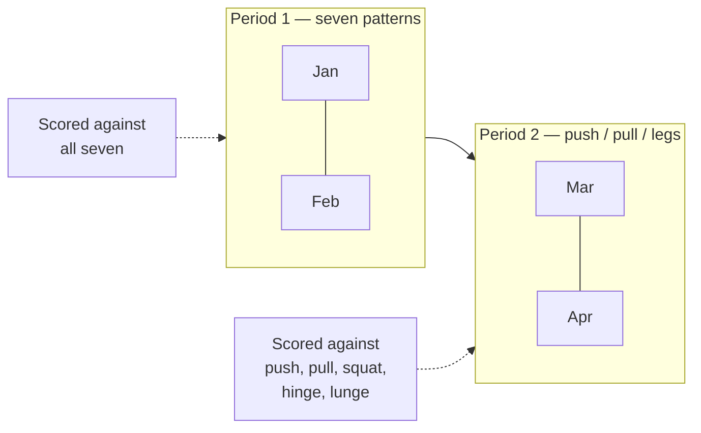

# The training model

This is the part of the codebase that is a *claim about training*, not a
technical choice. Change it carefully.

## Patterns

Seven movement patterns — squat, hinge, lunge, push, pull, rotate, carry — plus
**isolation**, which is taggable but has `counts: false` and is therefore never a
coverage box. The thesis of the app is that most people train four of the seven
and never notice; rotation and carries are the two that go missing.

A pattern has a stable `key` for translation and a `name` the user can overwrite.
`patternName()` prefers the key's translation and falls back to the user's
wording — so renaming something keeps *your* word for it in every language.

## Splits

A split decides **how the week is organised and what a complete week means**, and
those are the same question. A push/pull week is complete once you have pushed
and pulled; scoring it against seven patterns would mark it down for work it
never set out to do, and a permanently red coverage view is one people stop
reading.

So each preset in `splits.ts` declares its own `covers` set. Only
`sevenPattern` demands rotation and carries — that is what it is *for*, not a
rule imposed on someone who chose push/pull/legs.

Presets materialise into ordinary `Slot` rows via `buildSlots()`. Nothing
downstream knows a preset was involved, which is exactly what lets a hand-built
split behave identically to a built-in one. `applySplit` and `applyCustomSplit`
both go through one `installSkeleton` for the same reason.

`minDays` is a promise, not a preference: below it a whole day type never
happens and the week cannot be covered, so the option is withheld rather than
offered and then quietly under-delivered.

## Coverage

`buildProgram` guarantees that a generated week touches every pattern the current
period asks for. The rotation heuristic does most of it and a **repair pass**
forces in anything missed — writing only into a slot whose own constraint permits
the pattern, so the repair cannot create the violation it exists to prevent.

The heuristic alone covers the seeded library, so the repair is proven by a
hand-built split instead: `splits.test.ts` "forces in a pattern the rotation
alone would leave out" fails when the repair pass is disabled.

### What fills a slot

The pattern is chosen first; two rules then act inside it.

- **A scored movement's main slot prefers a lift the index counts** (owner,
  2026-09-19). The main slot is the movement's first slot in the week. If the
  pick there is a machine or a part-body move, `preferCounting` walks on
  through the pool to the next real weight, pull-up, chin-up or dip; machines
  still fill the other slots. A pool with none keeps its pick. The repair
  gives what it forces in the same preference, and when it overwrites a
  movement's main slot, that movement's next slot takes the preference over.
  `countsForIndex` in `strength.ts` is the one test for both the generator and
  the index. Before this rule, 41% of generated weeks left a trained scored
  movement with nothing the index counts — measured over every preset, legal
  day count, gym or home, bias and all 997 offsets, 143,568 weeks. After it,
  none do. The only case left is a pool with no lift that counts, and no
  scored movement has one today, at the gym or at home (`coach.test.ts`
  checks every main slot in every configuration).
- **The range follows the movement, not the slot** (GYM-67): 6–12 reps, 8–12
  for rotation, 10–15 for isolation, 30–40 m for a carry — in a finisher, a
  full-body accessory slot or whatever the repair writes.

Walking on from the pick, rather than re-picking from the lifts that count,
leaves every slot whose pick already counted as it was, so the offset below
still decides the week. Only a new or rebuilt week changes; a stored week keeps
its lifts until "Rebuild my week".

### How far into the library a week reaches

`pick()` indexes a pattern's pool by day-plus-position, a small number, so any
one account only ever reaches a subset of the library. In the pool's own order,
across all 144 preset × day-count × location × bias configurations, that is
**59 of 70**. That figure was once documented as the whole story; it is not.

- **The main cause at this size was a shared seed, not the small index.** The
  pattern and the exercise in a slot were chosen with the *same* number. Where a
  slot alternates between two patterns by parity — the finisher's rotation and
  carry — each pattern only ever received even, or only odd, indexes, so three
  of the eight gym rotation movements could never be reached by anybody.
- **Real accounts never saw 59, by accident.** Their exercise rows had hashed
  ids, the device returns rows in id order, so each account's pool came out
  shuffled differently: 55–65 of 70 each, and every exercise reachable by
  *somebody*. The shared catalogue gives every account the same ids in the same
  order, which would have silently collapsed everybody onto the same 59.

So `buildProgram` takes a **`variety`** — `varietyFor(profile.id)`, a stable
per-account offset applied to the exercise choice only, never to the pattern
choice. The week's layout, its coverage and every slot constraint are exactly
what they were; which exercise fills each slot differs between accounts. The
repair pass selects the same way instead of always forcing the head of the pool.

- **Zero is the offset every fixed week uses.** The demo seed passes 0, as do
  every test fixture and the e2e suite, because the demo's history is authored
  against one specific week. `coach.test.ts` holds variety zero to 67 of 85 —
  59 of 70 before the library grew, 68 before main slots preferred a lift that
  counts. A bigger pool is a different input; the preference is a different
  rule.
- **Across forty accounts every programmable exercise is reached**, machines
  included; one account still reaches 58–72 of the 85, 65 at the median,
  measured over all 997 values `varietyFor` can return. That is the honest
  shape of it: this restores the per-account spread the storage accident
  provided, rather than giving any one account the whole library.
- **Nothing moves on the day it ships.** A stored week is never regenerated on
  its own; `buildProgram` only runs at onboarding, on an explicit rebuild, on a
  split change and when a plan is applied.

> **Deliberately not done:** preferring exercises you have not done recently.
> Measured, it takes a user who rebuilds six times from 15 distinct exercises to
> 62. It is also a product decision rather than a fix — a rebuild to switch to
> training at home would rotate out a lift somebody is progressing on, including
> one with a live goal — and it needs rules about which slots it may touch. It
> waits for that decision.
>
> The swap sheet remains the way to reach everything. It now has search and
> grouping, through the same picker as "Log something else", which it needed
> before the library could grow.

## Historisation

**The one invariant that matters most.** Three months of seven-pattern weeks
still read as seven-pattern weeks after you move to push/pull.

A switch **appends a `SplitPeriod`** from this Monday and never edits an older
one; a second switch in the same week replaces that week's period, because two
with one start would be read in no particular order. Each period records the
split, the day count, and a *frozen copy* of the coverage goal — frozen so that
history survives us changing what a preset means in a later release, and
survives the user renaming a pattern.

- `periodFor(ix, weekOf)` — the latest period starting on or before that week.
- A week earlier than every period gets the earliest one, which is the closest
  honest answer available.
- Periods start on a **Monday**, because a week is the unit of coverage.
  Switching on a Thursday applies to the whole of that week.
- Opening the *first* period on an account that pre-dates periods **backfills**
  the old one first. Without that, a first-ever switch hands every earlier week
  the new split and silently rescores all of it.

`coversFor()` narrows a goal to what the slots can actually reach, so an edit
that removes the only slot capable of holding a carry stops demanding one — a box
that can never be ticked is worse than no box.

## What the weight box is counting

Every number below this line is arithmetic on one figure a person typed, so what
that figure *means* is load-bearing. The app asked for a "weight" for months and
never said. On a barbell that is nearly harmless. On two dumbbells it is a
**factor of two**, and nothing stored says which side of it a row is on.

`packages/domain/src/load.ts` gives every catalogue exercise a **load class**, and
`load.test.ts` asserts the two lists agree in both directions so a new exercise
cannot arrive without one. The class is per exercise, not per equipment type —
"a dumbbell number means both" would define every single-arm row and suitcase
carry in the library wrongly.

| Class | You enter | Stored | A mass? |
| --- | --- | --- | --- |
| `barbell` | The bar and the plates together | as typed | yes |
| `dumbbellPair` | **One dumbbell** | **×2** | yes |
| `dumbbellOne` | The one implement you hold | as typed | yes |
| `machine` | The setting on the stack | as typed | **no** |
| `bodyweight` | Only what you added | as typed | **no** |
| `partial` | What you loaded, not what reaches your hands | as typed | **no** |

**Entered per hand, stored combined.** The entry side is what people already do
and can read off the implement — Strength Level, Fitbod and Strong are all
per-hand. The stored side is what the literature means: Farias et al. 2017 say
"the sum of the 2 dumbbells combined", Heinecke et al. 2021 give both halves in
one protocol, and every same-subject dumbbell-to-barbell ratio (0.79–0.93) only
makes sense read that way — doubled, they would put dumbbells above the barbell,
inverting the one thing that literature agrees on. No standards body defines it,
though: we are picking a convention and citing precedent, not inheriting one.

The conversion happens at **exactly one boundary**, the weight box on the Train
card, and it happens in view: type 20 and the line under the box says it will be
recorded as 40. Everywhere else in the app — the logged rows, the calendar, the
charts, the score — shows the stored load, so there is one number in the system.

### `mass: false` is the honest half

It is false more often than is comfortable, and it is what keeps a stack setting
out of anything absolute:

- **Machines.** McMillin 2024 measured **−48% to +70%** at the handle across a
  single stroke. The pin number is a position.
- **Cables.** The pulley ratio is not readable by the user and is not reported
  anywhere — "pulley ratio" returns no exercise-science papers at all.
- **Sleds.** The resistance is surface friction, which nobody measures.
- **Landmines.** What reaches the hands is a fraction of the sleeve, set by the
  bar's angle.

False does not mean "do not log it". Charting a stack setting against itself is
sound — the machine does not change between Tuesdays. It means the number is
never summed with a barbell load or used to compare two people: **neither
strength number takes it** (Decision log D-022). `strength.test.ts` walks the
whole catalogue to hold that.

**The one exception: the whole body moves.** `WHOLE_BODY` in `load.ts` marks the
pull-ups, chin-ups and dips — Pull-Up, Chin-Up, Weighted Pull-Up, Chest-to-Bar
Pull-Up, Dip, Ring Dip. They stay `bodyweight` (the box takes only what was
added), but the index counts them at **bodyweight plus what was added**, the
bodyweight being the one the index divides by that week. A push-up, inverted row
or Nordic curl moves part of the body, and what share would be a guess, so they
stay out like machines.

Two barbell caveats nothing can fix: **hex bar** mass is unstandardised and never
reported (the two comparison studies disagree by ~8% and neither states it), and
**Smith machine** carriage mass is never reported either, which is why
`Smith Machine Squat` is classed `machine`.

### History before the convention

`LOAD_CONVENTION_FROM` is a **dated constant, not a column on the profile.** The
convention ships in the client bundle, so every account crosses over in the same
deploy and a per-account column would have carried one value in every row — the
full migration, sync-field, spec and diagram cost for data with one possible
value. (A device on the previous build keeps writing the old meaning for a day or
two; a column would not have fixed that, since it would be written server-side at
deploy time.)

Nothing is rewritten. A retroactive doubling would be right for some rows and
wrong by two for others, with nothing stored to separate them.

Instead the app says so where it shows. **The convention cancels within either
side of the cutover** — somebody's dumbbell bench trend is sound on one reading
throughout — so the only thing that goes wrong is the step *at* the cutover,
where somebody who logged one dumbbell starts logging both. `conventionChanged`
in `load.ts` looks for that step: the median of the last three sessions before
`LOAD_CONVENTION_FROM` against the first three after, and true only when the
later sit at least half as high again. The exercise chart then carries a note
at the date, and so does the index when any scored lift has the step.

**Decided by the step, not by the dates.** The first version was true whenever
a history merely crossed the cutover. That misfires on anybody who already
entered both dumbbells — they cross the date and see no jump — and on the demo,
whose history is dated relative to today and straddled the cutover within a
week of shipping. Two properties survive either way: DOTS reads only barbell
lifts, so the one cross-person number never touches a dumbbell pair, and a
chart note is information, not a repair — the history stays as stored.

## The two strength numbers

Both live in `packages/domain/src/strength.ts`, which was split out of
`model.ts` when the second one arrived.

**There used to be one, and it was a category error.** It summed the best
estimated one-rep max across **five** patterns and scaled the result with DOTS —
a curve fitted to the **three**-lift powerlifting total. Changing the numerator
while keeping the reference gives a ratio between two quantities that do not
measure the same thing, and the error was not small: at 83 kg a real 450 kg
squat/bench/deadlift total scores 304, while a five-pattern sum of 650 kg scores
439. **Exactly 4/9 — 44% — of that came from counting more lifts**, and because
the coefficient cancels, that inflation was bodyweight-independent. Anybody who
checked us against a public calculator would have found us wrong.

Keeping one of the two was not an option either, because they answer different
questions. So:

### `dotsAt` — a real DOTS

Squat, bench and deadlift, on the bar, nothing else. `total × 500 / P(bw)` with
the published per-sex polynomials. **The one number here that means anything to
anybody else**, and every digit of it is verified against the OpenPowerlifting
reference implementation.

- **Strictly the three named lifts.** A front squat is not a competition squat
  and a trap bar is not a competition deadlift. Null until all three are in the
  window, because a total missing a lift is not a smaller total — it is not a
  total, and a zero would report somebody who has never benched as weak rather
  than as unmeasured.
- **The strictness is ours, not the formula's.** DOTS will scale any total you
  hand it; OpenPowerlifting scores a bench-only entry from the bench alone. That
  keeps the arithmetic right and makes the number mean nothing, which is the
  failure this whole split exists to undo.
- **No age allowance.** Plain DOTS is a function of total, bodyweight and sex
  and nothing else; masters coefficients (McCulloch, Foster) are a separate
  multiplier that produces a separately *named* score. Public calculators do not
  ask for age. Applying one would put us ~13% out at 50, ~34% at 60 and ~65% at
  70 against anything somebody checks us with.
- **Only masses reach it.** All three lifts are `barbell` in `load.ts`;
  `competitionLiftsAreMasses()` is asserted, so adding a fourth lift or
  swapping one for a machine variant fails the suite.

"Published" deserves care, because this file used to overclaim it: DOTS has **no
peer-reviewed derivation**, no stated sample size or fit statistics, and it is
**not** the IPF's formula — IPF GL Points is. What it has is ubiquity and a fixed
definition. That makes it checkable, not authoritative.

### `strengthAt` — gymmy's own index

All five loaded patterns, `total / bw^(2/3)`, times the age allowance, to one
decimal place.

- **A pattern never trained counts as zero**, so coverage moves the number.
  That is the app's whole thesis and the reason this number exists next to a
  three-lift one.
- **Real weights only.** Each pattern's best comes from barbell, dumbbell and
  kettlebell lifts (`mass: true`), plus pull-ups, chin-ups and dips at
  bodyweight plus what was added (`indexEstimate` in `strength.ts`, same
  10-rep ceiling). A machine, landmine or push-up best adds nothing, however
  heavy; it still charts against itself. So a pattern trained only on machines
  counts as zero — which is why a generated week gives each scored movement's
  main slot a lift that counts ([What fills a slot](#what-fills-a-slot)).
  Every row counts, whatever its date: a pull-up, chin-up or dip logged before
  `LOAD_CONVENTION_FROM` (2026-09-17), when the box did not yet say "added",
  counts as added weight, so anyone who typed their bodyweight there counts
  double until those sets leave the eight-week window (from the week of 9
  November 2026).
- **Two-thirds, not one.** From geometric similarity: force goes with
  cross-sectional area (length squared) while mass is a length cubed. A plain
  bodyweight multiple is wrong at both ends.
- **One exponent, not one per lift.** No exponent has been *derived* for a lunge
  or a row — the one row study applies an assumed two-thirds — so per-lift
  exponents would mean inventing two of five. And the per-lift figures first
  considered (squat 0.515, bench 0.345, deadlift 0.394) are not solid enough to
  build on anyway: they are Table 3 of Montenegro, Wicker & Donath 2026, an
  academic study rather than the "federation analysis" this page once called
  it, fitted to the twenty all-time strongest lifters per sex with no
  confidence intervals, and other studies disagree with them.
- **Its own scale, and it says so.** Not comparable between people, and the copy
  on screen says that rather than implying a ranking.
- **Deliberately a different magnitude.** The index lands in the tens with a
  decimal; a DOTS lands in the hundreds as an integer. Two three-digit numbers
  on one card get read as the same number twice, so the index is always rendered
  to one decimal *including a trailing zero* — otherwise the week it rounds even
  is the week it disguises itself as the other number.

**Where two-thirds comes from, verified.** Theory: Åstrand & Rodahl, *Textbook
of Work Physiology* (1986). Recommended for routine strength testing by Jaric
2002 (Sports Med 32:615–631) and Jaric, Mirkov & Markovic 2005 (JSCR
19:467–474); Vanderburgh 1999 calls strength ÷ mass^(2/3) "probably the single
best adjustment technique". Both of those conclusions survived an adversarial
check against the primary abstracts.

What it is **not** is the measured exponent for trained lifters, which comes out
lower — 0.550 for men and 0.500 for women across 308,530 tested raw
powerlifters (Montenegro, Wicker & Donath 2026), bench 0.57 and squat 0.60 in
Dooman & Vanderburgh 2000. Against those, two-thirds over-corrects slightly: it
divides by a little more than the data says for a heavier lifter. Since the
index never compares people, the only place that shows is somebody's own chart
when their bodyweight moves — gaining weight costs the index slightly more than
it should. That trade is deliberate: a measured exponent is population-specific
and, by the same literature, changes with sex, level, body composition and the
lift.

### True of both

- **`sex` is asked for DOTS and only DOTS.** "Prefer not to say" is a
  first-class answer that leaves DOTS blank: DOTS publishes two curves, and the
  midpoint this once took is a number no other calculator gives — 18% above a
  man's real score at 83 kg, and every account started there.
- **Five patterns, not seven**, for the index. A carry is logged by distance, so
  its "reps" are metres and a 1RM estimated from them is not a number about
  strength. Rotation is trained light and anti-rotational by design.
- **An eight-week trailing window**, because they describe what you can do
  *now*: the scored week and the seven before it, so from the Monday seven
  weeks back. Seven, not eight — going back eight Mondays makes nine weeks.
  `strength.test.ts` pins both edges for both numbers.
- **Null rather than a guess** when bodyweight is unknown. Both are ratios;
  inventing the denominator invents the answer. They are null for two different
  reasons and the screen distinguishes them — "still missing: …" for an absent
  lift, "add your bodyweight" for an absent denominator. An e2e test caught that
  conflation, not a reading of the code.
- **Neither is a meet total.** A real total is three singles on one day under
  judging; these are built from `est1RM` over eight weeks, so they read high of
  what anybody would lift on the day. That caveat is on screen, in the DOTS
  explainer, not only here.

Bodyweight is its own dated record (`bodyLogs`) rather than a profile field: the
numbers divide by what you weighed *that week*, and one current value would
rewrite what every past week meant every time you stepped on a scale.

`est1RM` is Epley **adjusted for reps in reserve** — without the RIR term a set
taken to failure and a set with three left look identical, which makes the whole
progress view lie.

### It refuses to estimate above 10 reps to failure

`MAX_EST_REPS_TO_FAILURE = 10`, checked against `reps + rir`, and past it
`est1RM` returns null exactly as it does for a set with no weight. Not an error
and not a zero: the app has no maximum to estimate from that set, and says so by
having nothing to say.

Epley is linear in reps and stays linear, so inverted it claims a 21-rep set was
58% of a maximum and a 30-rep set exactly half of one. Real rep-max curves
flatten, so the error is not noise — it runs one way, upward, and grows with the
rep count. **A 30-rep deadlift at 100 kg reads as a 200 kg single.** Nothing
downstream would question it: it would enter the strength score as a personal
best on a lift nobody ever maxed, sit there for eight weeks, and then be reported
as a *decline* when it aged out of the window.

**Both the number and the quantity it bounds are corrections.** The first version
was twelve, counted on reps alone, and both halves were wrong:

- Twelve was the top of `REP_RANGE.big` — *this app's own prescribed range*,
  which is an argument about our programming and not about the estimate's
  validity. The published bounds are all lower: Brzycki's 1993 article says under
  ten, Reynolds et al. 2006 "no more than 10", and Mayhew et al. 1995 found all
  six common equations significantly biased above ten. Nobody publishes a ceiling
  at twelve.
- Counting reps alone guarded a quantity the estimate never used. `est1RM` feeds
  Epley `reps + rir`, so a twelve-rep set with four in reserve passed a check for
  twelve and was then extrapolated from as a sixteen — the exact invented maximum
  the ceiling exists to refuse.

**The cost is large and was accepted with the number in hand.** The effort
control defaults to two in reserve, so only sets of eight or fewer now produce an
estimate, while the app prescribes 6–12. On the demo account this takes the
estimable share of logged sets from 77% to 39%. Those sets are still training:
they fill the week's coverage and chart by the weight on the bar. They are simply
not turned into a one-rep maximum.

One thing no source supports at all, and this ceiling does not vindicate:
treating `reps + rir` as equivalent to reps to failure. Every validation study
took subjects to momentary failure, and the substitution is itself off by about
one rep (Halperin et al. 2022). The ceiling bounds that substitution; it does not
justify it.

Two things downstream used to assume "trained" and "chartable" were the same day,
and both are now wrong:

- **`lastDate` is the last day trained**, never the last day plotted. Read off
  the chart it freezes on the last heavy day, and the lift drifts into "not
  trained in three weeks" while somebody is in the gym doing it — and dormancy is
  the one verdict needing no goal, so the app would say it unprompted.
- **A loaded pattern with nothing chartable falls back to the weight on the bar**,
  the same demotion isolation already gets. Only when there is nothing at all to
  plot: a lift with both heavy and high-rep days keeps its estimate and simply
  omits the high-rep points.

### Movements the app records but never prescribes

A catalogue entry tagged `offPlan` (`OFF_PLAN` in `catalogue.ts`) is excluded
from `pool()` and from `swapOptions()`. It can be logged, and a trainer can still
name one in a plan; the generator will not put it in anybody's week.

This exists because the library has conditioning work — thrusters, wall balls,
box jumps, the Olympic lifts — so that a class can be logged at all. (Not
burpees, running or rowing: monostructural work has no load to measure.) Each is fine to
have done and poor to be *handed*: a generated slot arrives asking for three
sets of six to twelve, which is not what anybody does with a medicine ball, and
a week built out of them reads as a programme nobody wrote.

It is a tag on the entry rather than anything stored: the catalogue is code, so
marking a movement off-plan is an edit to `catalogue.ts` and reaches every
account with the next deploy, with no migration and nothing synced. A
pre-catalogue row of the same name reads as the catalogue entry, tag included,
so an older account cannot bring an off-plan movement back through its own
library. The filter sits in
`pool()`'s **base** rather than its tag argument: `pool` is called again with a
null tag whenever a bias empties a pattern, and that fallback is exactly where an
off-plan movement would otherwise reappear.

### Training outside the plan

"Log something else", below the planned cards on Train, logs any exercise in the
library — including the off-plan ones above — as **ordinary `set_logs` rows under
the reserved session label `OFF_PLAN_SESSION` (`X`)**. No new table, no new
column: a synced table opens a window where a device on the previous build
silently misses rows, and a column is the documented trap where adding a field
does not move the change sequence.

What it counts for, deliberately:

- **Coverage — yes.** Everything that reads logs without caring about the
  session picks these up unchanged: coverage, both strength numbers, goals, the
  charts, "last time". That was the decision — training is training.
- **The week's session count — yes, and the inflation is accepted.** Extra sets
  on a day that also has a planned session read as two sessions that day.
- **A planned day — never.** Not even when the off-plan exercise is the one the
  day plans. That is why these sets cannot simply be logged under whichever day
  tab is open: it would tick the day. Picking a lift the open day already plans
  opens the day's own card instead.

**The one thing that had to be fixed for this to be safe:** turning a label back
into a day number. `planDayOf()` is now the only way to do it, and it answers
null for `X`. The alternative was `charCodeAt(0) - 65`, which reads `X` as day
23 and clamps it to the last day — so one extra set logged first thing would
have opened the last day of the week all morning. There were two copies of that
arithmetic, one in `nextSession` and one inlined in the Train page despite
`nextSession`'s own docstring warning that two copies would drift. Train uses
`nextSession` now.

`oneOffs(ix, date)` reads a date's off-plan training back from the logs alone —
never from "not in any program entry", which would reclassify last month's
extra sets as planned the day somebody rebuilt their week.

## Goals, and the permission they grant

`attention()` produces two of its three verdicts **only for a lift the user has
set a goal on**. With no goals — the state every account starts in and returns
to — the app describes and does not grade: the charts are drawn, the numbers are
honest, and nothing says whether any of it was enough.

This is not a tone preference. "Your bench press is not progressing, it needs a
look" is a judgement about what somebody was trying to do, and the app does not
know that. Aimed at a person maintaining deliberately, coming back from an
injury, or training because it makes their week better, it costs motivation and
buys nothing. The failure mode was never a wrong number; it was somebody reading
that their training had let them down and doing less of it.

So evaluation is opt-in, one lift at a time. **A goal is consent**: it names the
lift, the number, and the date it stops mattering.

- It is per-lift, so permission for one is not permission for all.
- It **expires** and is never renewed automatically. Silence is the resting
  state and has to be deliberately interrupted, not deliberately restored.
- It is withdrawable in one tap from the card it appears on. A permission you
  cannot easily revoke is not one.

`growingExercises(ix, today)` is the set of exercise ids with a live goal, and
it is what gates the verdicts. `regressed` and `stalled` are withheld without
it. **`dormant` is not gated** — "this is in your week and you have not done it
in three weeks" is an observation about the plan the user chose themselves, not
a claim about growth, and it is the one thing here somebody wants either way.

### The guardrails, and what the evidence does not say

`checkGoal()` in `goals.ts` refuses four things and warns about one. The refusals
are about whether a goal is *measurable* and has *room to happen* — never about
whether it is impressive.

| | Rule | Why |
| --- | --- | --- |
| refuse | target under **+5%** | A retested one-rep max varies by about **4.2%** on its own (median within-subject CV across 32 studies, pooled n = 1595 — Grgic et al., *Sports Medicine – Open* 2020;6:31). A smaller goal cannot be told from a good day. |
| refuse | under **8 weeks** | Not a figure from a study, and the code says so. It follows from two that are: progression is per-successful-session, and a detectable change has to clear that CV — so the horizon must hold enough sessions for enough increments to add up. |
| refuse | over **52 weeks** | Past a year it is a hope, and the app would be nagging for one. |
| refuse | more than **3 live** | You cannot ask to be pushed on everything. |
| warn | an implied rate far past the user's own trailing gain | Trained lifters add roughly **7.5–12.5%** in their first measured year, and strength against training time goes as log(time) — Steele et al., *RQES*, doi:10.1080/02701367.2022.2070592. |

The ambition check is measured against **this person's own trailing six-month
gain, doubled** (`recentGainOf`), falling back to the literature figure only
when there is not enough history. A novice and a ten-year lifter differ by more
than one threshold can express, and their own rate is the only measurement of
which they are.

It **warns rather than refuses**, because commitment is what makes a goal work
at all and a goal somebody has rejected as not theirs performs *worse* than no
goal (Locke & Latham, *American Psychologist* 2002;57(9):705-717). The app says
what it knows and leaves the decision with the person doing the training.

The sheet opens on `suggestedTarget`, and the "too small" line offers it too.
It is rounded **up** to the input's 0.5 step, never to the nearest one: rounding
to nearest fell under +5% for about half of all baselines, and the app refused
its own offer. A test holds every one-decimal baseline to 300 to that.

**The offer never carries the ambition warning**, and neither does anything
below it; a higher number the person types gets the ordinary check (the owner,
2026-09-19). Rounding up is why the rule is needed: on a light lift it can
carry the offer past the line — with no history and a horizon under six months,
any baseline up to about 18.6; 13 offers 14, +7.7% against 7.5% — and the sheet
warned about the number it had just filled in. The rule lives in `checkGoal`,
beside the offer, so every caller gets it. The sheet fills the offer in once,
for the horizon on screen: switch to a shorter one afterwards and the same
number is checked like any other, so it can warn.

**There is deliberately no expected pace.** The first version of this feature
gave every goal a linear rate and flagged you for being behind it — and that is
the one shape the literature does not support. ACSM's 2–10% load increase is
*per exercise, once the lifter can already exceed the target reps*, not per week
(*Med Sci Sports Exerc* 2009;41(3):687-708). No major body publishes a safe
percent-per-week rate of gain. A `GoalProgress` therefore carries `moved` — has
this cleared the retest CV, yes or no — and a test asserts the field list, so an
`expected` reappearing fails the suite.

The practitioner "2-for-2 rule" and its kilo increments are a textbook
convention rather than a research finding, and the kilo figures in circulation
are 20–25% above the percentages they claim to implement. They are not quoted to
the user as evidence, because they are not evidence.

Nothing here is enforced server-side beyond the shape of the row: the guardrails
run on the client because they are the same rules an offline device has to apply
to the same write.

### How a goal ends

`outcomeOf()` has three results and none of them is "failed". Reaching it is
`achieved`. Ending short but with the lift really moved — `moved`, more than
the 4.2% a retest wanders on its own — is `partly`, reported as what was added.
Anything less is `flat`, reported as information: 100 → 110 ending at 102 is
flat, because two kilos is a good day and "still added 2 kg" would credit the
app's own noise. The same line decides both ways, so a lift that moved is never
told it did not, however far off the target was. An ended goal lingers on
the card for three weeks rather than vanishing on its date — the app asked for
two months of somebody's attention, and disappearing in silence the morning it
expires is the one ending that says nothing at all.

## The triage

`attention()` in `insights.ts` decides what the Progress page leads with. Three
verdicts, and **the order they are tested in is the model, not an
implementation detail**:

1. **Regressed** — a confident drawdown of 5% or worse against recent form.
   *Needs a live goal on the lift.*
2. **Dormant** — still in your plan, untouched for 21 days. *Always shown.*
3. **Stalled** — no higher for 8 weeks *and* 6 sessions. *Needs a live goal.*

Dormant is tested **before** stalled because a stall says *you keep turning up
and it will not move*, and that claim requires you to have turned up. Run the
other way round — which it was — and a lift abandoned during a flat stretch
comes out as "no higher than July, and 0 sessions since then": nonsense, and it
buries the only useful thing to say, which is that it is still in your week and
you are not doing it.

The thresholds are deliberately slack. At 4 weeks and 3 sessions the demo
account had nine of its eleven lifts flagged as stalled, and a page that says
most of your training needs a look is a page nobody acts on.

Results are then taken **a kind at a time** rather than strictly worst-first, so
three stalls cannot bury the one lift you stopped doing.

## What the Train card offers you

`lastSession(ix, exerciseId)` in `coach.ts` — the heaviest weight of the most
recent session on that lift, the fewest reps at that weight, and the date. The
Train card prefills those numbers so repeating a session costs one tap, and
captions them as history: *"Last time 60 kg × 8 · 12/09/2026"*.

With no history there is nothing to repeat, so the card starts somewhere
neutral rather than empty (`startWeight` / `startReps` in `entry.ts`): the bar
for a barbell lift, 10 kg dumbbells, 20 kg on a machine, no added weight on a
bodyweight lift, and the bottom of the plan's rep range — the plan's own shape,
not a judgement about you. The numbers are set without the phone's keyboard,
in one of three styles chosen in Settings (buttons, a ruler with a range
realistic for the equipment, or loading the bar plate by plate); flow 11 in
`e2e/flows` describes them.

**There is no rule here, and that is the design.** This section used to describe
double progression: `suggest()` read your last session, and if you had hit the
top of the rep range with reps to spare it told you to add 2.5 kg and drop back
to the bottom; if you had nothing left it told you to repeat; otherwise it told
you to chase one more rep. Home carried a *Ready for more weight* card listing
every lift the rule had decided had earned it, and Train warned you when your
recent sets looked too easy.

All of it is gone. See **Decision log D-014**, but the short version:

- The rule was defensible and still had to go. It only ever said "add weight"
  after *you* reported reps left in the tank at the top of the range — that is a
  conservative, mainstream reading of double progression, and it was not a bug.
- Being defensible is not the same as standing to give the instruction. gymmy
  cannot see your form breaking down, does not know you slept badly, has never
  heard about the shoulder, and is not qualified to tell somebody training alone
  to put more on the bar. **Load is the one variable where being confidently
  wrong hurts a person rather than a number.**
- So the app records, measures what it honestly can, and stops. Prefilling last
  time's number is a record; telling you to beat it is advice.

What survives, and why it is not advice:

- **The prefill.** It is what you did, not what to do. `e2e/progression.spec.ts`
  asserts both halves — that the record is there and usable, and that none of
  the old copy is.
- **The effort question.** Still asked, still in words. It feeds `est1RM`, which
  every chart and the strength score read; a set at nothing-left and a set with
  three to spare are different measurements. It no longer feeds any suggestion.
- **Rep ranges and set counts** on a generated or shared plan. Those are the
  shape of the week, which is a different claim from "add weight now" — and a
  range written by a *trainer* is a human prescribing, which is what a trainer
  is for.

