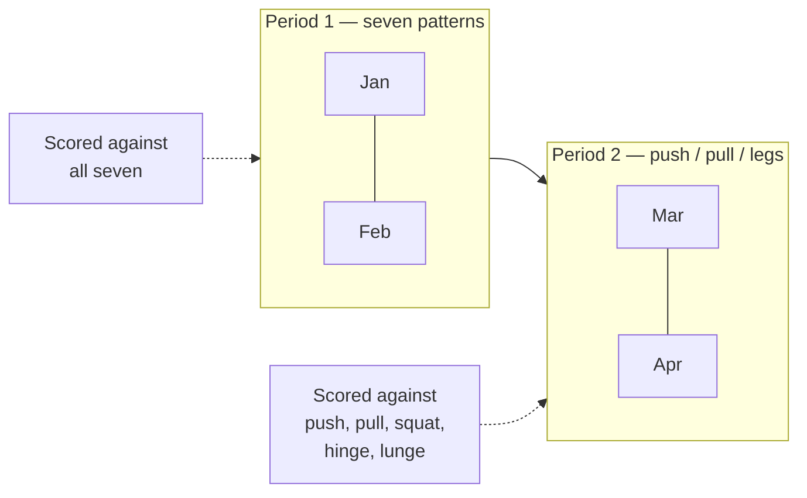

# The training model

This is the part of the codebase that is a *claim about training*, not a
technical choice. Change it carefully.

## Patterns

Seven movement patterns — squat, hinge, lunge, push, pull, rotate, carry — plus
**isolation**, which is taggable but has `counts: false` and is therefore never a
coverage box. The thesis of the app is that most people train four of the seven
and never notice; rotation and carries are the two that go missing.

A pattern has a stable `key` for translation and a `name` the user can overwrite.
`patternName()` prefers the key's translation and falls back to the user's
wording — so renaming something keeps *your* word for it in every language.

## Splits

A split decides **how the week is organised and what a complete week means**, and
those are the same question. A push/pull week is complete once you have pushed
and pulled; scoring it against seven patterns would mark it down for work it
never set out to do, and a permanently red coverage view is one people stop
reading.

So each preset in `splits.ts` declares its own `covers` set. Only
`sevenPattern` demands rotation and carries — that is what it is *for*, not a
rule imposed on someone who chose push/pull/legs.

Presets materialise into ordinary `Slot` rows via `buildSlots()`. Nothing
downstream knows a preset was involved, which is exactly what lets a hand-built
split behave identically to a built-in one. `applySplit` and `applyCustomSplit`
both go through one `installSkeleton` for the same reason.

`minDays` is a promise, not a preference: below it a whole day type never
happens and the week cannot be covered, so the option is withheld rather than
offered and then quietly under-delivered.

## Coverage

`buildProgram` guarantees that a generated week touches every pattern the current
period asks for. The rotation heuristic does most of it and a **repair pass**
forces in anything missed — writing only into a slot whose own constraint permits
the pattern, so the repair cannot create the violation it exists to prevent.

> **Known gap:** disabling the repair pass entirely does not currently fail any
> test — the heuristic alone covers the seeded library. The guarantee is
> asserted but not *proven*. A case that forces the repair to matter would be a
> genuine addition.

> **Known gap, and the one to read before growing the library:** `pick()`
> indexes a pattern's pool by day-plus-position, a number that never exceeds 9,
> so the generator **saturates**. Measured across every preset, legal day count,
> location and bias: **59 of the current 70 exercises are ever programmed
> automatically, 87 of 150, and still 87 of 230.** Eleven of the seventy we ship
> are already unreachable unless somebody picks them by hand.
>
> Adding exercises therefore changes nobody's week. It only lengthens the swap
> sheet, which is an uncapped list of full-width buttons with no search and no
> grouping. Selection has to be fixed alongside any library growth, or the work
> is invisible.

## Historisation

**The one invariant that matters most.** Three months of seven-pattern weeks
still read as seven-pattern weeks after you move to push/pull.

A switch **appends a `SplitPeriod`**; it never edits one. Each period records the
split, the day count, and a *frozen copy* of the coverage goal — frozen so that
history survives us changing what a preset means in a later release, and
survives the user renaming a pattern.

- `periodFor(ix, weekOf)` — the latest period starting on or before that week.
- A week earlier than every period gets the earliest one, which is the closest
  honest answer available.
- Periods start on a **Monday**, because a week is the unit of coverage.
  Switching on a Thursday applies to the whole of that week.
- Opening the *first* period on an account that pre-dates periods **backfills**
  the old one first. Without that, a first-ever switch hands every earlier week
  the new split and silently rescores all of it.

`coversFor()` narrows a goal to what the slots can actually reach, so an edit
that removes the only slot capable of holding a carry stops demanding one — a box
that can never be ticked is worse than no box.

## What the weight box is counting

Every number below this line is arithmetic on one figure a person typed, so what
that figure *means* is load-bearing. The app asked for a "weight" for months and
never said. On a barbell that is nearly harmless. On two dumbbells it is a
**factor of two**, and nothing stored says which side of it a row is on.

`packages/domain/src/load.ts` gives every seeded exercise a **load class**, and
`load.test.ts` asserts the two lists agree in both directions so a new exercise
cannot arrive without one. The class is per exercise, not per equipment type —
"a dumbbell number means both" would define every single-arm row and suitcase
carry in the library wrongly.

| Class | You enter | Stored | A mass? |
| --- | --- | --- | --- |
| `barbell` | The bar and the plates together | as typed | yes |
| `dumbbellPair` | **One dumbbell** | **×2** | yes |
| `dumbbellOne` | The one implement you hold | as typed | yes |
| `machine` | The setting on the stack | as typed | **no** |
| `bodyweight` | Only what you added | as typed | **no** |
| `partial` | What you loaded, not what reaches your hands | as typed | **no** |

**Entered per hand, stored combined.** The entry side is what people already do
and can read off the implement — Strength Level, Fitbod and Strong are all
per-hand. The stored side is what the literature means: Farias et al. 2017 say
"the sum of the 2 dumbbells combined", Heinecke et al. 2021 give both halves in
one protocol, and every same-subject dumbbell-to-barbell ratio (0.79–0.93) only
makes sense read that way — doubled, they would put dumbbells above the barbell,
inverting the one thing that literature agrees on. No standards body defines it,
though: we are picking a convention and citing precedent, not inheriting one.

The conversion happens at **exactly one boundary**, the weight box on the Train
card, and it happens in view: type 20 and the line under the box says it will be
recorded as 40. Everywhere else in the app — the logged rows, the calendar, the
charts, the score — shows the stored load, so there is one number in the system.

### `mass: false` is the honest half

It is false more often than is comfortable, and it is what keeps a stack setting
out of anything absolute:

- **Machines.** McMillin 2024 measured **−48% to +70%** at the handle across a
  single stroke. The pin number is a position.
- **Cables.** The pulley ratio is not readable by the user and is not reported
  anywhere — "pulley ratio" returns no exercise-science papers at all.
- **Sleds.** The resistance is surface friction, which nobody measures.
- **Landmines.** What reaches the hands is a fraction of the sleeve, set by the
  bar's angle.

False does not mean "do not log it". Charting a stack setting against itself is
sound — the machine does not change between Tuesdays. It means the number must
not be summed with a barbell load or used to compare two people.

Two barbell caveats nothing can fix: **hex bar** mass is unstandardised and never
reported (the two comparison studies disagree by ~8% and neither states it), and
**Smith machine** carriage mass is never reported either, which is why
`Smith Machine Squat` is classed `machine`.

### History before the convention

`LOAD_CONVENTION_FROM` is a **dated constant, not a column on the profile.** The
convention ships in the client bundle, so every account crosses over in the same
deploy and a per-account column would have carried one value in every row — the
full migration, sync-field, spec and diagram cost for data with one possible
value. (A device on the previous build keeps writing the old meaning for a day or
two; a column would not have fixed that, since it would be written server-side at
deploy time.)

Nothing is rewritten. `conventionKnown(name, date)` is false only for a
dumbbell-pair row dated before the cutover — the one class whose meaning moved.
A retroactive doubling would be right for some rows and wrong by two for others,
with nothing stored to separate them.

What that false must gate is narrow: **the convention cancels in any
same-exercise comparison**, so somebody's own dumbbell bench trend is sound on
either reading. It is the absolute, cross-person figure that has nothing left to
cancel it.

## The strength score

One number for "how much do I move, relative to me", in
`model.ts` under `SCORED_PATTERNS`.

It is the sum of the best estimated one-rep max in each of the **five loaded**
patterns, scaled by **DOTS** — the published bodyweight-and-sex curve used in
competitive powerlifting.

- **DOTS rather than a bodyweight multiple.** Strength does not scale linearly
  with mass; dividing by bodyweight flatters a light lifter and punishes a heavy
  one. The curve is published, stable and checkable.
- **`sex` is asked for this and only this.** "Prefer not to say" takes the
  midpoint of the two curves and is a first-class answer.
- **Five patterns, not seven.** A carry is logged by distance, so its "reps" are
  metres and a 1RM estimated from them is not a number about strength. Rotation
  is trained light and anti-rotational by design.
- **An eight-week trailing window**, because it describes what you can do *now*.
  A pattern never trained counts as zero, so coverage moves the score too.
- **Null rather than a guess** when bodyweight is unknown. It is a ratio;
  inventing the denominator invents the answer.

Bodyweight is its own dated record (`bodyLogs`) rather than a profile field: the
score divides by what you weighed *that week*, and one current value would
rewrite what every past week meant every time you stepped on a scale.

`est1RM` is Epley **adjusted for reps in reserve** — without the RIR term a set
taken to failure and a set with three left look identical, which makes the whole
progress view lie.

### It refuses to estimate above 10 reps to failure

`MAX_EST_REPS_TO_FAILURE = 10`, checked against `reps + rir`, and past it
`est1RM` returns null exactly as it does for a set with no weight. Not an error
and not a zero: the app has no maximum to estimate from that set, and says so by
having nothing to say.

Epley is linear in reps and stays linear, so inverted it claims a 21-rep set was
58% of a maximum and a 30-rep set exactly half of one. Real rep-max curves
flatten, so the error is not noise — it runs one way, upward, and grows with the
rep count. **A 30-rep deadlift at 100 kg reads as a 200 kg single.** Nothing
downstream would question it: it would enter the strength score as a personal
best on a lift nobody ever maxed, sit there for eight weeks, and then be reported
as a *decline* when it aged out of the window.

**Both the number and the quantity it bounds are corrections.** The first version
was twelve, counted on reps alone, and both halves were wrong:

- Twelve was the top of `REP_RANGE.big` — *this app's own prescribed range*,
  which is an argument about our programming and not about the estimate's
  validity. The published bounds are all lower: Brzycki's 1993 article says under
  ten, Reynolds et al. 2006 "no more than 10", and Mayhew et al. 1995 found all
  six common equations significantly biased above ten. Nobody publishes a ceiling
  at twelve.
- Counting reps alone guarded a quantity the estimate never used. `est1RM` feeds
  Epley `reps + rir`, so a twelve-rep set with four in reserve passed a check for
  twelve and was then extrapolated from as a sixteen — the exact invented maximum
  the ceiling exists to refuse.

**The cost is large and was accepted with the number in hand.** The effort
control defaults to two in reserve, so only sets of eight or fewer now produce an
estimate, while the app prescribes 6–12. On the demo account this takes the
estimable share of logged sets from 77% to 39%. Those sets are still training:
they fill the week's coverage and chart by the weight on the bar. They are simply
not turned into a one-rep maximum.

One thing no source supports at all, and this ceiling does not vindicate:
treating `reps + rir` as equivalent to reps to failure. Every validation study
took subjects to momentary failure, and the substitution is itself off by about
one rep (Halperin et al. 2022). The ceiling bounds that substitution; it does not
justify it.

Two things downstream used to assume "trained" and "chartable" were the same day,
and both are now wrong:

- **`lastDate` is the last day trained**, never the last day plotted. Read off
  the chart it freezes on the last heavy day, and the lift drifts into "not
  trained in three weeks" while somebody is in the gym doing it — and dormancy is
  the one verdict needing no goal, so the app would say it unprompted.
- **A loaded pattern with nothing chartable falls back to the weight on the bar**,
  the same demotion isolation already gets. Only when there is nothing at all to
  plot: a lift with both heavy and high-rep days keeps its estimate and simply
  omits the high-rep points.

### Movements the app records but never prescribes

An exercise tagged `offPlan` (`OFF_PLAN` in `coach.ts`) is excluded from `pool()`
and from `swapOptions()`. It can be logged, and a trainer can still name one in a
plan; the generator will not put it in anybody's week.

This exists because the library is gaining conditioning work — thrusters, wall
balls, burpees, box jumps — so that a class can be logged at all. Each is fine to
have done and poor to be *handed*: a generated slot arrives asking for three
sets of six to twelve, which is not what anybody does with a medicine ball, and
a week built out of them reads as a programme nobody wrote.

It is a tag rather than a column because `tags` is already a string array on the
wire, in Dexie and in Postgres — so it costs no migration and no version bump,
and a row that has never heard of it simply does not carry it. The filter sits in
`pool()`'s **base** rather than its tag argument: `pool` is called again with a
null tag whenever a bias empties a pattern, and that fallback is exactly where an
off-plan movement would otherwise reappear.

## Goals, and the permission they grant

`attention()` produces two of its three verdicts **only for a lift the user has
set a goal on**. With no goals — the state every account starts in and returns
to — the app describes and does not grade: the charts are drawn, the numbers are
honest, and nothing says whether any of it was enough.

This is not a tone preference. "Your bench press is not progressing, it needs a
look" is a judgement about what somebody was trying to do, and the app does not
know that. Aimed at a person maintaining deliberately, coming back from an
injury, or training because it makes their week better, it costs motivation and
buys nothing. The failure mode was never a wrong number; it was somebody reading
that their training had let them down and doing less of it.

So evaluation is opt-in, one lift at a time. **A goal is consent**: it names the
lift, the number, and the date it stops mattering.

- It is per-lift, so permission for one is not permission for all.
- It **expires** and is never renewed automatically. Silence is the resting
  state and has to be deliberately interrupted, not deliberately restored.
- It is withdrawable in one tap from the card it appears on. A permission you
  cannot easily revoke is not one.

`growingExercises(ix, today)` is the set of exercise ids with a live goal, and
it is what gates the verdicts. `regressed` and `stalled` are withheld without
it. **`dormant` is not gated** — "this is in your week and you have not done it
in three weeks" is an observation about the plan the user chose themselves, not
a claim about growth, and it is the one thing here somebody wants either way.

### The guardrails, and what the evidence does not say

`checkGoal()` in `goals.ts` refuses four things and warns about one. The refusals
are about whether a goal is *measurable* and has *room to happen* — never about
whether it is impressive.

| | Rule | Why |
| --- | --- | --- |
| refuse | target under **+5%** | A retested one-rep max varies by about **4.2%** on its own (median within-subject CV across 32 studies, pooled n = 1595 — Grgic et al., *Sports Medicine – Open* 2020;6:31). A smaller goal cannot be told from a good day. |
| refuse | under **8 weeks** | Not a figure from a study, and the code says so. It follows from two that are: progression is per-successful-session, and a detectable change has to clear that CV — so the horizon must hold enough sessions for enough increments to add up. |
| refuse | over **52 weeks** | Past a year it is a hope, and the app would be nagging for one. |
| refuse | more than **3 live** | You cannot ask to be pushed on everything. |
| warn | an implied rate far past the user's own trailing gain | Trained lifters add roughly **7.5–12.5%** in their first measured year, and strength against training time goes as log(time) — Steele et al., *RQES*, doi:10.1080/02701367.2022.2070592. |

The ambition check is measured against **this person's own trailing six-month
gain, doubled** (`recentGainOf`), falling back to the literature figure only
when there is not enough history. A novice and a ten-year lifter differ by more
than one threshold can express, and their own rate is the only measurement of
which they are.

It **warns rather than refuses**, because commitment is what makes a goal work
at all and a goal somebody has rejected as not theirs performs *worse* than no
goal (Locke & Latham, *American Psychologist* 2002;57(9):705-717). The app says
what it knows and leaves the decision with the person doing the training.

**There is deliberately no expected pace.** The first version of this feature
gave every goal a linear rate and flagged you for being behind it — and that is
the one shape the literature does not support. ACSM's 2–10% load increase is
*per exercise, once the lifter can already exceed the target reps*, not per week
(*Med Sci Sports Exerc* 2009;41(3):687-708). No major body publishes a safe
percent-per-week rate of gain. A `GoalProgress` therefore carries `moved` — has
this cleared the retest CV, yes or no — and a test asserts the field list, so an
`expected` reappearing fails the suite.

The practitioner "2-for-2 rule" and its kilo increments are a textbook
convention rather than a research finding, and the kilo figures in circulation
are 20–25% above the percentages they claim to implement. They are not quoted to
the user as evidence, because they are not evidence.

Nothing here is enforced server-side beyond the shape of the row: the guardrails
run on the client because they are the same rules an offline device has to apply
to the same write.

### How a goal ends

`outcomeOf()` has three results and none of them is "failed". Reaching it is
`achieved`; ending with real distance covered is `partly`, reported as what was
added; ending flat is `flat`, reported as information. An ended goal lingers on
the card for three weeks rather than vanishing on its date — the app asked for
two months of somebody's attention, and disappearing in silence the morning it
expires is the one ending that says nothing at all.

## The triage

`attention()` in `insights.ts` decides what the Progress page leads with. Three
verdicts, and **the order they are tested in is the model, not an
implementation detail**:

1. **Regressed** — a confident drawdown of 5% or worse against recent form.
   *Needs a live goal on the lift.*
2. **Dormant** — still in your plan, untouched for 21 days. *Always shown.*
3. **Stalled** — no higher for 8 weeks *and* 6 sessions. *Needs a live goal.*

Dormant is tested **before** stalled because a stall says *you keep turning up
and it will not move*, and that claim requires you to have turned up. Run the
other way round — which it was — and a lift abandoned during a flat stretch
comes out as "no higher than July, and 0 sessions since then": nonsense, and it
buries the only useful thing to say, which is that it is still in your week and
you are not doing it.

The thresholds are deliberately slack. At 4 weeks and 3 sessions the demo
account had nine of its eleven lifts flagged as stalled, and a page that says
most of your training needs a look is a page nobody acts on.

Results are then taken **a kind at a time** rather than strictly worst-first, so
three stalls cannot bury the one lift you stopped doing.

## What the Train card offers you

`lastSession(ix, exerciseId)` in `coach.ts` — the heaviest weight of the most
recent session on that lift, the fewest reps at that weight, and the date. The
Train card prefills those numbers so repeating a session costs one tap, and
captions them as history: *"Last time 60 kg × 8 · 12/09/2026"*.

**There is no rule here, and that is the design.** This section used to describe
double progression: `suggest()` read your last session, and if you had hit the
top of the rep range with reps to spare it told you to add 2.5 kg and drop back
to the bottom; if you had nothing left it told you to repeat; otherwise it told
you to chase one more rep. Home carried a *Ready for more weight* card listing
every lift the rule had decided had earned it, and Train warned you when your
recent sets looked too easy.

All of it is gone. See **Decision log D-014**, but the short version:

- The rule was defensible and still had to go. It only ever said "add weight"
  after *you* reported reps left in the tank at the top of the range — that is a
  conservative, mainstream reading of double progression, and it was not a bug.
- Being defensible is not the same as standing to give the instruction. gymmy
  cannot see your form breaking down, does not know you slept badly, has never
  heard about the shoulder, and is not qualified to tell somebody training alone
  to put more on the bar. **Load is the one variable where being confidently
  wrong hurts a person rather than a number.**
- So the app records, measures what it honestly can, and stops. Prefilling last
  time's number is a record; telling you to beat it is advice.

What survives, and why it is not advice:

- **The prefill.** It is what you did, not what to do. `e2e/progression.spec.ts`
  asserts both halves — that the record is there and usable, and that none of
  the old copy is.
- **The effort question.** Still asked, still in words. It feeds `est1RM`, which
  every chart and the strength score read; a set at nothing-left and a set with
  three to spare are different measurements. It no longer feeds any suggestion.
- **Rep ranges and set counts** on a generated or shared plan. Those are the
  shape of the week, which is a different claim from "add weight now" — and a
  range written by a *trainer* is a human prescribing, which is what a trainer
  is for.

