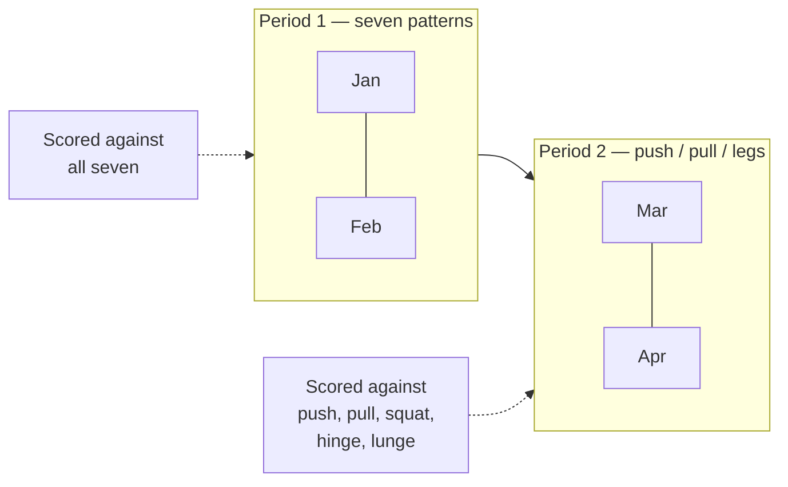
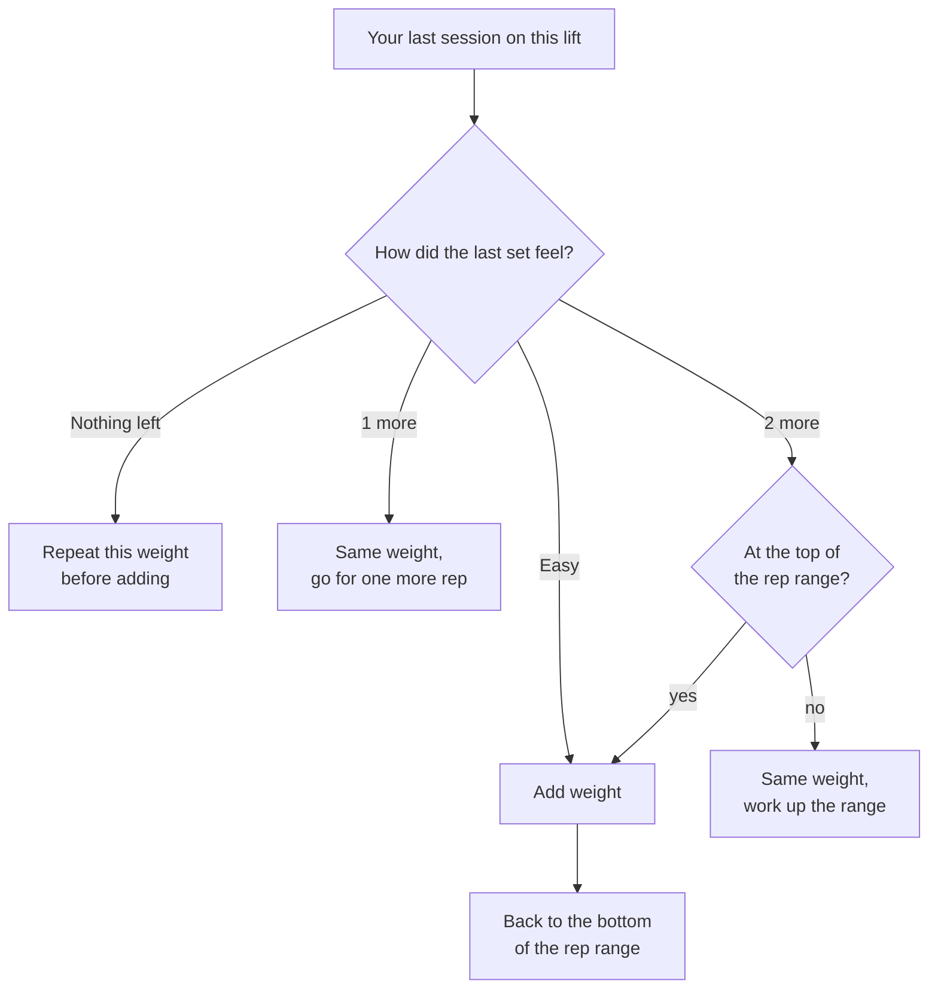

# The training model

This is the part of the codebase that is a *claim about training*, not a
technical choice. Change it carefully.

## Patterns

Seven movement patterns — squat, hinge, lunge, push, pull, rotate, carry — plus
**isolation**, which is taggable but has `counts: false` and is therefore never a
coverage box. The thesis of the app is that most people train four of the seven
and never notice; rotation and carries are the two that go missing.

A pattern has a stable `key` for translation and a `name` the user can overwrite.
`patternName()` prefers the key's translation and falls back to the user's
wording — so renaming something keeps *your* word for it in every language.

## Splits

A split decides **how the week is organised and what a complete week means**, and
those are the same question. A push/pull week is complete once you have pushed
and pulled; scoring it against seven patterns would mark it down for work it
never set out to do, and a permanently red coverage view is one people stop
reading.

So each preset in `splits.ts` declares its own `covers` set. Only
`sevenPattern` demands rotation and carries — that is what it is *for*, not a
rule imposed on someone who chose push/pull/legs.

Presets materialise into ordinary `Slot` rows via `buildSlots()`. Nothing
downstream knows a preset was involved, which is exactly what lets a hand-built
split behave identically to a built-in one. `applySplit` and `applyCustomSplit`
both go through one `installSkeleton` for the same reason.

`minDays` is a promise, not a preference: below it a whole day type never
happens and the week cannot be covered, so the option is withheld rather than
offered and then quietly under-delivered.

## Coverage

`buildProgram` guarantees that a generated week touches every pattern the current
period asks for. The rotation heuristic does most of it and a **repair pass**
forces in anything missed — writing only into a slot whose own constraint permits
the pattern, so the repair cannot create the violation it exists to prevent.

> **Known gap:** disabling the repair pass entirely does not currently fail any
> test — the heuristic alone covers the seeded library. The guarantee is
> asserted but not *proven*. A case that forces the repair to matter would be a
> genuine addition.

## Historisation

**The one invariant that matters most.** Three months of seven-pattern weeks
still read as seven-pattern weeks after you move to push/pull.

A switch **appends a `SplitPeriod`**; it never edits one. Each period records the
split, the day count, and a *frozen copy* of the coverage goal — frozen so that
history survives us changing what a preset means in a later release, and
survives the user renaming a pattern.

- `periodFor(ix, weekOf)` — the latest period starting on or before that week.
- A week earlier than every period gets the earliest one, which is the closest
  honest answer available.
- Periods start on a **Monday**, because a week is the unit of coverage.
  Switching on a Thursday applies to the whole of that week.
- Opening the *first* period on an account that pre-dates periods **backfills**
  the old one first. Without that, a first-ever switch hands every earlier week
  the new split and silently rescores all of it.

`coversFor()` narrows a goal to what the slots can actually reach, so an edit
that removes the only slot capable of holding a carry stops demanding one — a box
that can never be ticked is worse than no box.

## The strength score

One number for "how much do I move, relative to me", in
`model.ts` under `SCORED_PATTERNS`.

It is the sum of the best estimated one-rep max in each of the **five loaded**
patterns, scaled by **DOTS** — the published bodyweight-and-sex curve used in
competitive powerlifting.

- **DOTS rather than a bodyweight multiple.** Strength does not scale linearly
  with mass; dividing by bodyweight flatters a light lifter and punishes a heavy
  one. The curve is published, stable and checkable.
- **`sex` is asked for this and only this.** "Prefer not to say" takes the
  midpoint of the two curves and is a first-class answer.
- **Five patterns, not seven.** A carry is logged by distance, so its "reps" are
  metres and a 1RM estimated from them is not a number about strength. Rotation
  is trained light and anti-rotational by design.
- **An eight-week trailing window**, because it describes what you can do *now*.
  A pattern never trained counts as zero, so coverage moves the score too.
- **Null rather than a guess** when bodyweight is unknown. It is a ratio;
  inventing the denominator invents the answer.

Bodyweight is its own dated record (`bodyLogs`) rather than a profile field: the
score divides by what you weighed *that week*, and one current value would
rewrite what every past week meant every time you stepped on a scale.

`est1RM` is Epley **adjusted for reps in reserve** — without the RIR term a set
taken to failure and a set with three left look identical, which makes the whole
progress view lie.

## Goals, and the permission they grant

`attention()` produces two of its three verdicts **only for a lift the user has
set a goal on**. With no goals — the state every account starts in and returns
to — the app describes and does not grade: the charts are drawn, the numbers are
honest, and nothing says whether any of it was enough.

This is not a tone preference. "Your bench press is not progressing, it needs a
look" is a judgement about what somebody was trying to do, and the app does not
know that. Aimed at a person maintaining deliberately, coming back from an
injury, or training because it makes their week better, it costs motivation and
buys nothing. The failure mode was never a wrong number; it was somebody reading
that their training had let them down and doing less of it.

So evaluation is opt-in, one lift at a time. **A goal is consent**: it names the
lift, the number, and the date it stops mattering.

- It is per-lift, so permission for one is not permission for all.
- It **expires** and is never renewed automatically. Silence is the resting
  state and has to be deliberately interrupted, not deliberately restored.
- It is withdrawable in one tap from the card it appears on. A permission you
  cannot easily revoke is not one.

`growingExercises(ix, today)` is the set of exercise ids with a live goal, and
it is what gates the verdicts. `regressed` and `stalled` are withheld without
it. **`dormant` is not gated** — "this is in your week and you have not done it
in three weeks" is an observation about the plan the user chose themselves, not
a claim about growth, and it is the one thing here somebody wants either way.

### The guardrails, and what the evidence does not say

`checkGoal()` in `goals.ts` refuses four things and warns about one. The refusals
are about whether a goal is *measurable* and has *room to happen* — never about
whether it is impressive.

| | Rule | Why |
| --- | --- | --- |
| refuse | target under **+5%** | A retested one-rep max varies by about **4.2%** on its own (median within-subject CV across 32 studies, pooled n = 1595 — Grgic et al., *Sports Medicine – Open* 2020;6:31). A smaller goal cannot be told from a good day. |
| refuse | under **8 weeks** | Not a figure from a study, and the code says so. It follows from two that are: progression is per-successful-session, and a detectable change has to clear that CV — so the horizon must hold enough sessions for enough increments to add up. |
| refuse | over **52 weeks** | Past a year it is a hope, and the app would be nagging for one. |
| refuse | more than **3 live** | You cannot ask to be pushed on everything. |
| warn | an implied rate far past the user's own trailing gain | Trained lifters add roughly **7.5–12.5%** in their first measured year, and strength against training time goes as log(time) — Steele et al., *RQES*, doi:10.1080/02701367.2022.2070592. |

The ambition check is measured against **this person's own trailing six-month
gain, doubled** (`recentGainOf`), falling back to the literature figure only
when there is not enough history. A novice and a ten-year lifter differ by more
than one threshold can express, and their own rate is the only measurement of
which they are.

It **warns rather than refuses**, because commitment is what makes a goal work
at all and a goal somebody has rejected as not theirs performs *worse* than no
goal (Locke & Latham, *American Psychologist* 2002;57(9):705-717). The app says
what it knows and leaves the decision with the person doing the training.

**There is deliberately no expected pace.** The first version of this feature
gave every goal a linear rate and flagged you for being behind it — and that is
the one shape the literature does not support. ACSM's 2–10% load increase is
*per exercise, once the lifter can already exceed the target reps*, not per week
(*Med Sci Sports Exerc* 2009;41(3):687-708). No major body publishes a safe
percent-per-week rate of gain. A `GoalProgress` therefore carries `moved` — has
this cleared the retest CV, yes or no — and a test asserts the field list, so an
`expected` reappearing fails the suite.

The practitioner "2-for-2 rule" and its kilo increments are a textbook
convention rather than a research finding, and the kilo figures in circulation
are 20–25% above the percentages they claim to implement. They are not quoted to
the user as evidence, because they are not evidence.

Nothing here is enforced server-side beyond the shape of the row: the guardrails
run on the client because they are the same rules an offline device has to apply
to the same write.

### How a goal ends

`outcomeOf()` has three results and none of them is "failed". Reaching it is
`achieved`; ending with real distance covered is `partly`, reported as what was
added; ending flat is `flat`, reported as information. An ended goal lingers on
the card for three weeks rather than vanishing on its date — the app asked for
two months of somebody's attention, and disappearing in silence the morning it
expires is the one ending that says nothing at all.

## The triage

`attention()` in `insights.ts` decides what the Progress page leads with. Three
verdicts, and **the order they are tested in is the model, not an
implementation detail**:

1. **Regressed** — a confident drawdown of 5% or worse against recent form.
   *Needs a live goal on the lift.*
2. **Dormant** — still in your plan, untouched for 21 days. *Always shown.*
3. **Stalled** — no higher for 8 weeks *and* 6 sessions. *Needs a live goal.*

Dormant is tested **before** stalled because a stall says *you keep turning up
and it will not move*, and that claim requires you to have turned up. Run the
other way round — which it was — and a lift abandoned during a flat stretch
comes out as "no higher than July, and 0 sessions since then": nonsense, and it
buries the only useful thing to say, which is that it is still in your week and
you are not doing it.

The thresholds are deliberately slack. At 4 weeks and 3 sessions the demo
account had nine of its eleven lifts flagged as stalled, and a page that says
most of your training needs a look is a page nobody acts on.

Results are then taken **a kind at a time** rather than strictly worst-first, so
three stalls cannot bury the one lift you stopped doing.

## Double progression

`suggest()` is the rule, and it is never shown to the user — the *target* is.
Reach the top of the rep range on every set with something left in the tank and
the weight goes up while reps drop to the bottom. Nothing left in the tank means
repeat before adding. Otherwise chase one more rep.
